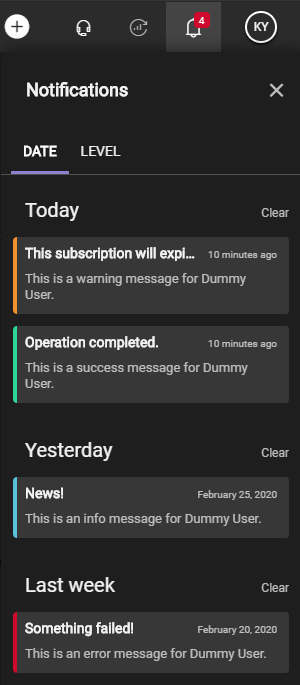
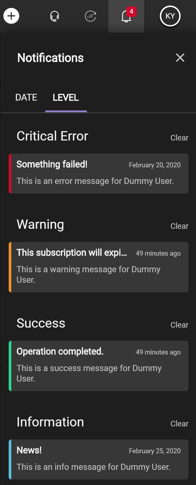

# Push Notifications Service (PNS) Specification v2.0 Details

## Technologies used

### SignalR

ASP.NET Core SignalR is an open-source library that simplifies adding real-time web functionality to apps. Real-time web functionality enables server-side code to push content to clients instantly. SignalR provides an API for creating server-to-client remote procedure calls (RPC). The RPCs call JavaScript functions on clients from server-side .NET Core code. More about SignalR can be found [here](https://docs.microsoft.com/en-us/aspnet/core/signalr/introduction?view=aspnetcore-3.1).

### Azure SignalR

This resource is used to redirect users connected to this service to the Azure SignalR service to avoid handling of large-scale client connections and other infrastructure tasks. This service mode configured in the resources is set to Default. More information about service modes can be found [here](https://github.com/Azure/azure-signalr/blob/dev/docs/faq.md#service-mode). More about Azure SignalR can be found [here](https://docs.microsoft.com/en-US/azure/azure-signalr/signalr-overview).

### Azure CosmosDb

This resource is used to store all type of notifications and it is used on this service because of the many advantages to the traditional database or other cloud database service like for example the ```time to live``` feature. More about Azure CosmosDb can be found [here](https://docs.microsoft.com/en-US/azure/cosmos-db/introduction).

### Primavera.Hydrogen.EventBus.Azure

This resource is used to listen to the notifications coming from a specific ServiceBus topic to not limiting the push of the notifications only by the controller. For now, it will be used to Listen to notifications from the Taskbox. More about Primavera.Hydrogen.EventBus.Azure can be found [here](https://github.com/PrimaveraDeveloper/lithium/blob/master/ref/hydrogen-2.0/EventBus.Azure.md).

# Getting started

## Notifications

The notifications received by this service must follow some rules in order to accept the notification and broadcast it to the target.

### Message

The messages is a List of messages (```IList<MessageItem>```) that will represent the "payload" of the notification and it following this structure:

```json
"Messages": [
	{
		"Key": "Title",
		"Value": "Controller notification!",
		"Culture": "en-US"
	},
	{
		"Key": "Message",
		"Value": "This is a warning message received from PushNotifications controller!",
		"Culture": "en-US"
	}
]
```

To this messages be displayed correctly by ```PushNotifications``` client service the following *keys* must be present in the message:
*  ```Title``` 
* ```Message```

So the notification will be displayed on the product like following:



### NotificationType

The notificationType is an enumerator that represents the type of the notification and it have the following structure:

* 0 - ```Info``` (default);
* 1 - ```Success```;
* 2 - ```Warning```;
* 3 - ```Error```;

The parameter can be sent like:
```json
"NotificationType": 0
```

The default value for notificationType will be used when the notificationType is not sent or if it is another type. Each notification have its own time to live that is calculated for each ```NotificationType``` when the ```ExpiresOn``` parameter is not sent. Each type has the following time to live:

* ```Info``` - 86400 seconds (24 hours);
* ```Success``` - 86400 seconds (24 hours);
* ```Warning``` - 691200 seconds (8 days);
* ```Error``` - 2592000 seconds (30 days);

This time to live can be changed in the ```appsettings.json``` configuration.

```json
"ServiceConfiguration": {
    "NotificationTimeToLive": {
      "Info": 86400,
      "Success": 86400,
      "Warning": 691200,
      "Error": 2592000
    }
}
```

After the notification expiration, it's automatically deleted from storage.

> The ```time to live``` can be turned off in the microservice by passing -1 to configuration like ```"Error": -1 ``` or when ```expiresOn``` parameter is sent via API.

Another usage for the notification type is to filter by criticality or level in the ```pushNotifications``` client service, so the notifications can be filtered by level and can have its own color for the type like:



### Context 

The context is a List of contexts (```IList<ContextItem>```) for the notification that can be used add more information to the notification and it have the following structure:

```json
"Context": [
    {
      "Key": "SomeContextKey",
      "Value": "SomeContextValue"
    }
  ]
```

The context can be used in the client side to filter or to complement the existing messages in a new notification implementation. Until now, the ```PushNotifications``` client service is not using context.

### ExpiresOn

The expiresOn is a DateTime in UTC (+0) format that will define the notification expiration date. If provided, it will override the ```Time To Live``` defined for the notificationType. The parameter can be sent like:

```json
"ExpiresOn": "2019-12-31T23:59:59Z"
```

For example, the provided expiresOn date will expire on the last moment of 2019 and will be automatically deleted.

### Source

The source is a string that defines from "where" is the notification is coming from. The source examples:

* ```Marketing``` - Marketing notifications (promotions and news).
* ```Taskbox``` - Notifications that are generated by the ```Taskbox```.

### Targets

The targets is a List of strings (```IList<string>```) that specify the targets/destinataries for the provided notification. The parameter can be sent like:

```json
"Targets": ["user@primaverabss.com", "dummy@primaverabss.com"]
```

The notification will be broadcasted to those two clients immediately if they are connected, if not, in the next connection.

### Full example
```json
{
  "Message": [
    {
      "Key": "Title",
      "Value": "News!",
      "Culture": "en-US"
    },
    {
      "Key": "Message",
      "Value": "Jasmin have reached 7.000 users!",
      "Culture": "en-US"
    }
  ],
  "NotificationType": 0,
  "Context": [
    {
      "Key": "Url",
      "Value": "https://my.jasminsoftware.com/news"
    }
  ],
  "ExpiresOn": "2019-12-09T11:30:00Z",
  "Source": "Marketing",
  "Targets": [
    "user@primaverabss.com", "dummy@primaverabss.com"
  ]
}
```

## How the notification is handled

The notification can be sent by the controller, or by EventBus. All received notifications are processed by a ```NotificationsManager``` and it is defined by ```INotificationsManager``` that calls other managers to process the notification.

> Processing a notification implies broadcasting the notification via SignalR to the connected clients and store it in the cosmosDb. The whole process is asynchronous. 

The received notification is converted to a specific service type ```IncomingNotification``` and can be passed as parameter to the ```NotificationsManager``` method ```ProcessNotificationAsync(notification)```. If there will be a need to receive the notification by another way, this manager can be called and do all the job for the notification processing after the notification is converted to the service type.

If there is no need to store the notification, ```SendNotificationToGroupAsync(notification)``` can be invoked to send directly the notification to a groups, after is converted to the service type ```OutgoingNotification```.

The notification also can be directly stored calling ```RegisterNotificationAsync(notification)``` after it is converted to the service type ```StoredNotification```.

### Notification types

#### IncomingNotification - Notification received by the service via API and EventBus.

| Property         | Type                  | Description                       |
|------------------|-----------------------|-----------------------------------|
| Message          | List of MessageItem   | The notification messages.        |
| Context          | List of ContextItem   | The notification context.         | 
| NotificationType | Enum NotificationType |The notification type.             |
| ExpiresOn        | DateTime? in UTC      | The notification expiration date. |
| Source           | String                |The notification source.           | 
| Targets          | List of Strings       | The notification targets.         |

#### StoredNotification - Notification stored on CosmosDb.

| Property         | Type                     | Description                                                |
|------------------|--------------------------|------------------------------------------------------------|
| Id               | Guid                     | Unique notification Id.                                    |
| CreatedOn        | DateTime in UTC          | DateTime when notification was created.                    |
| Ttl              | Long int                 | The notification time to live.                             |
| Message          | List of MessageItem      | The notification messages.                                 |
| NotificationType | Enum NotificationType    | The notification type.                                     |
| Context          | List of ContextItem      | The notification context.                                  | 
| ExpiresOn        | DateTime? in UTC         | The notification expiration date.                          |
| Source           | String                   | The notification source.                                   | 
| Target           | Strings                  | The notification target.                                   |
| Disposed         | List of DisposedDetails  | Defines who has disposed the notification.                 |

#### OutgoingNotification - Notification that is broadcasted to the clients via SignalR.

| Property         | Type                  | Description                                                |
|------------------|-----------------------|------------------------------------------------------------|
| Id               | Guid                  | Unique notification Id.                                    |
| CreatedOn        | DateTime in UTC       | DateTime when notification was created.                    |
| Message          | List of MessageItem   | The notification messages.                                 |
| NotificationType | Enum NotificationType | The notification type.                                     |
| Context          | List of ContextItem   | The notification context.                                  | 
| Source           | String                | The notification source.                                   |
| Target           | String                | The notification target.                                   |

#### DisposedNotifications - Notifications that have been disposed by the user.

| Property         | Type                  | Description                                                |
|------------------|-----------------------|------------------------------------------------------------|
| DisposedBy       | String                | User that disposed the notification/notifications.         |
| DisposedItems    | List of DisposedItem  | Disposed notification/notifications                        |

### Common items

#### NotificationType - used in IncomingNotification, StoredNotification and OutgoingNotification.

| Enum | Value   | Description  | _UI Color_ |
|------|---------|--------------|------------|
| 0    | Info    | Information. | Blue       |
| 1    | Success | Success.     | Green      |
| 2    | Warning | Warning.     | Orange     |
| 3    | Error   | Error.       | Red        |

#### MessageItem - used in the Message List.

| Property         | Type   | Description                                                |
|------------------|--------|------------------------------------------------------------|
| Key              | String | Message item key.                                          |
| Value            | String | Message item value.                                        |
| Culture          | String | Message item culture.                                      |

#### ContextItem - used in the Context List.

| Property         | Type   | Description                                                |
|------------------|--------|------------------------------------------------------------|
| Key              | String | Context item key.                                          |
| Culture          | String | Context item culture.                                      |

#### DisposedItem - used in the DisposedItems List (when disposing a notification).

| Property         | Type   | Description          |
|------------------|--------|----------------------|
| Id               | Guid   | Notification id.     |
| Target           | String | Notification target. |

#### DisposedDetails - used in the Disposed List.

| Property         | Type            | Description                              |
|------------------|-----------------|------------------------------------------|
| DisposedBy       | String          | User that disposed the notification.     |
| DisposedOn       | DateTime in UTC | Date when the notification was disposed. |

## Authorization & Authentication

### Authorization to invoke hub methods

To start a ```WebSocket``` connection from the client to server, the server on the negotiation request must provide a token. 

This token must have the following scope: ```lithium-pushnotifications-hub```.

### Authorization to call pushNotifications endpoint

To call the pushNotifications endpoint the client must have a token with the following scope: ```lithium-pushnotifications```.

### Authorization to call other endpoints

To call other endpoints, the client must have a token with the following scope: ```lithium-pushnotificationsservice```.

## Notifications Central life-cycle

### Client connection to PushNotifications service

When the client enters the product, notification central, using ```SignalR```, starts the connection with the microservice (PNS) sending a negotiation request with the product token (that already should have the needed scope). This negotiation is immediately redirected to the ```Azure SignalR``` which starts selecting a transport protocol with the client and after the selecting of transports are completed, completes the negotiation and there is a persistent connection with the client and the microservice. When the connection is established, the process of _groups registration_ starts.

### Get notifications

After the client is connected and the groups are registered the pushNotifications invokes the hub method ```GetNotificationsAsync(groups)``` with a list of groups that this client want to receive notifications. When this method is invoked, all the notifications for the specified groups are broadcasted to the client except those the client has disposed previously.

> Note: when a notification arrives to be broadcasted to the groups, it is broadcasted to all clients that are registered in the specified groups. When the ```GetNotificationsAsync``` method is invoked, it is broadcasted only to the caller.

### Dispose notifications

The client, using the Notifications Central UI, can dispose a specific notification or all the notifications in the same category (clean all warning notifications). When a notification is disposed, the Notifications Central call's the hub method ```DisposeNotificationsAsync(DisposedNotifications)``` that is provided with the list of disposed notifications that contains the user that disposed the notifications and which notifications. Then the microservice process the notifications that have been disposed and they are never shown again to the client. 

> Note: When a notification is for many destinataries, they are still shown to the users that have not disposed the notification.

## How to establish a ```persistent``` connection and listen notifications without the Notifications Central UI

To create a persistent connection with the service to listen to the notifications a client package was create to this matter. Also the code to establish the connection, receive & show notifications and invoke hub methods can be found here:

```
$/Elevation3/FW/4.00/Development-Core/Framework/Development/Client/ElevationJS/services;

$/Elevation3/FW/4.00/Development-Core/Framework/Development/Client/ElevationJS/pushnotifications;
```

### Packages

_The package to use to establish the persistent connection with the server is @primavera/services (```npm install @primavera/services```)._

_The package to use the notifications central UI is @primavera/pushNotifications (```npm install @primavera/pushNotifications```)._

## EventBus

The pushNotifications service is also listening to the notifications that are coming from EventBus. The properties can be found in ```appsettings.json```. Example:

```json
{
  "EventBus": {
    "Address": "Endpoint=sb://someAddress.servicebus.windows.net/;SharedAccessKeyName=RootManageSharedAccessKey;SharedAccessKey=someKey",
    "PublicationTopic": null,
    "SubscriptionTopic": "pns",
    "MaxConcurrentCalls": 10,
    "AutoComplete": false,
    "SubscriptionFilters": [
      {
        "Key": "Source",
        "Value": "TBX"
      },
      {
        "Key": "Version",
        "Value": "1.0"
      }
    ]
  }
}
```

The event that is received by the microservice should be a ```DataTransferObject```. The eventBus handler will try to map the object in to a notification, and if it successfully maps to the ```IncomingNotification``` type, it will process the notification like it does when the notification comes from the endpoint.

If there is the need to add a new listener to another notification event (external), the new listener can be added following [this howto example](../../../../howto/howto-subscribe-new-notifications-events.md#getting-started).