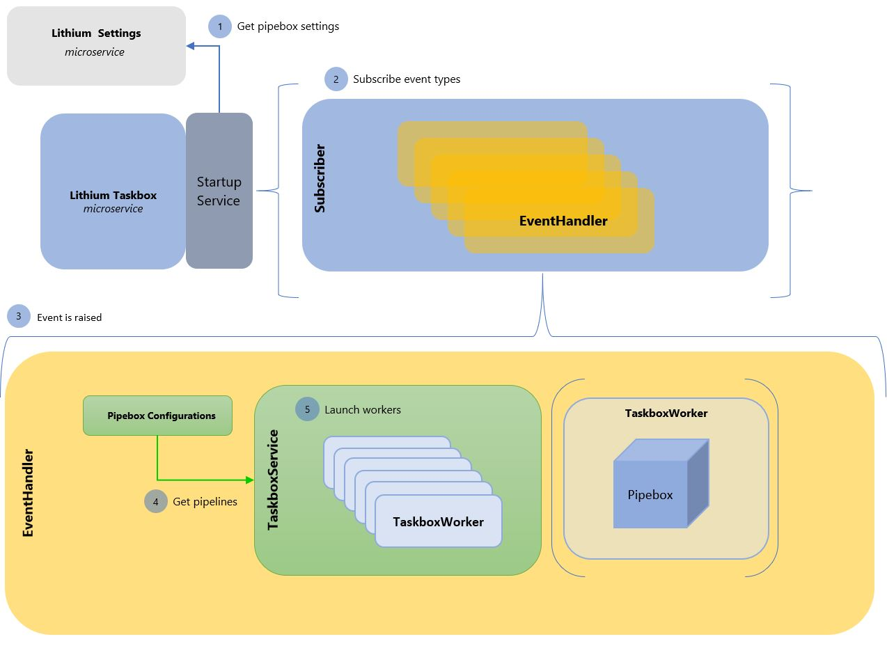

# Primavera.Lithium.Taskbox

Provides asynchronous multi-task processing for applications or services that need to improve performance, scalability and reusability. This component implements the asynchronous operation behaviour in the PRIMAVERA Elevation Platform. This process can follow different strategies.

The supported strategies are the following:

### Event Bus strategy

#### Strategy flow 

1. When the microservice starts, it starts at the same time a startup service, that will perform the following tasks:
    - Get the pipebox settings that are stored in the Lithium settings.
    - Checks if the EventBus topics exist, if these do not exist, these are created.

2. Reads the pipebox settings to get the events and subscribes to them. To subscribe is necessary to pass the event type and it's properties as well the handler that will handle this event when it's raised. This handler is called `EventHandler`.

3. When the event is triggered, the `EventHandler` converts the event into a known object called `TriggeredEvent`, this object contains properties and extensions so that the `TasboxService` can process any event type.

4. After the conversion, the next step is to read the pipebox settings, from where the microservice subscribed to the events and get all the pipelines that are triggered by the event.

5. Finally, the `EventHandler` commands the `TaskboxService` to execute a worker for each pipeline triggered by the event. The `TaskboxService` will try to instantiate a worker of the event type and will build a pipebox to execute the given pipeline.

### Caching

- **Subscribed Events**

  When the events are subscribed, these are stored in the cache. In this case, and because the data is important for the correct functioning of the service, the lifetime is not set.

- **Settings**

    When the settings are loaded, these are stored in the cache because these are necessary for various operations. The lifetime in which this data is cached is set to 24 hours since these do not change very often.

### EventBus

This resource is used to subscribe and unsubscribe to events on Service Bus topics. These topics and all that is related to the use of this resource is configured in the microservice settings.
To Know more about Primavera.Hydrogen.EventBus.Azure can be found [here](../../../ref/hydrogen-2.0/EventBus.Azure.md#Primavera.Hydrogen.EventBus.Azure).

### Taskbox

This resource is used to process multiple tasks asynchronously. Also, this resource is responsible for managing a pool of workers. 

To Know more about Primavera.Hydrogen.Taskbox can be found [here](../../../ref/hydrogen-2.0/Taskbox.md).

## Details

To Know more about this microservice click [here](https://tfs.primaverabss.com/tfs/P.TEC.Elevation/Lithium/_versionControl?path=%24%2FLithium%2FMicroservices%2FCommon%2FTBX%2FMainline%2Freadme.md&version=T&_a=preview).

