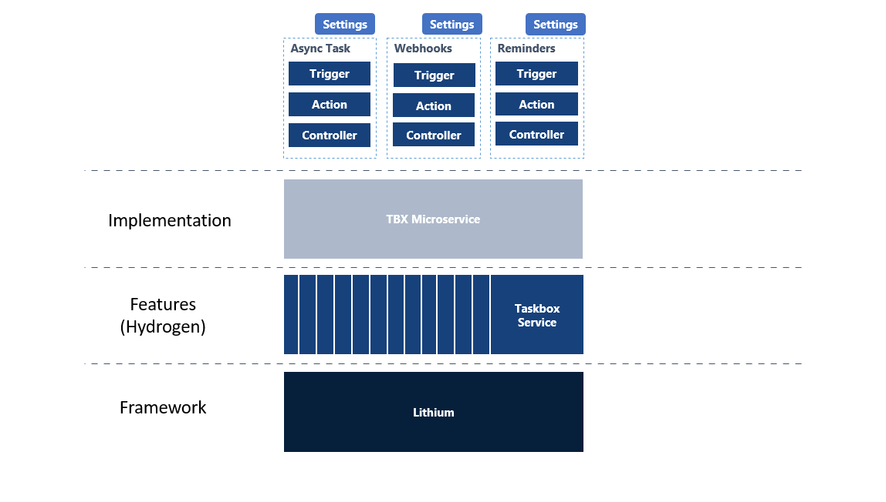
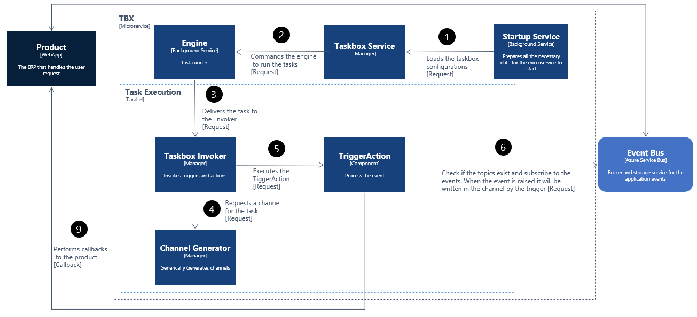
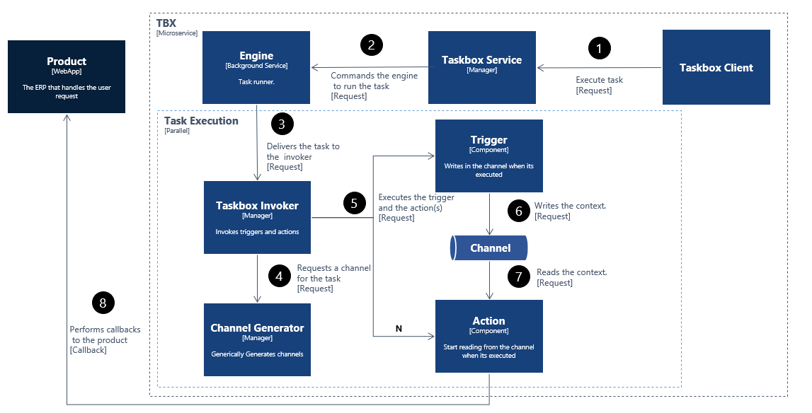
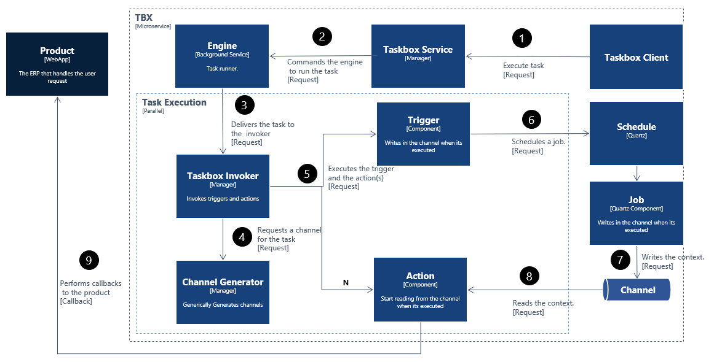
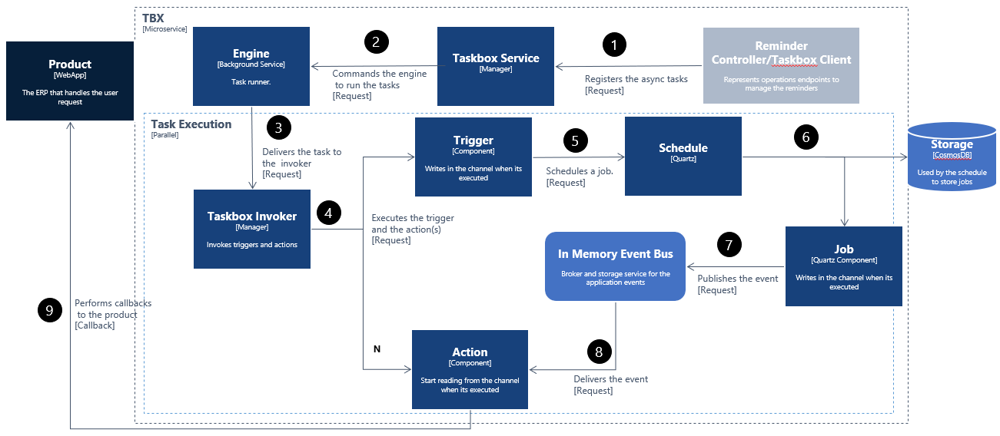

# Primavera.Lithium.Taskbox

Provides asynchronous multi-task processing for applications or services that need to improve performance, scalability, and reusability. This component implements the asynchronous operation behavior in the PRIMAVERA Elevation Platform. This process can follow different strategies.

## Taskbox Architecture

The taskbox microservice is divided into 3 different strategies. All of these use the taskbox service feature that is provided by the hydrogen library.

The following image shows how the microservice is organized.



## Async Tasks Strategy

### EventTrigger

#### Implementation

For this strategy, the abstract class `EventTrigger` was used to implement the EventBusTrigger, it receives a `PipeboxConfig` used to subscribe to the events. When the event is raised it reads the `PipeboxConfig` and retrieves the pipeline then executes this pipeline using the `Pipebox`.

```csharp
 public class EventBusTrigger : EventTrigger<DataTransferObject>
 {
    /// <inheritdoc/>
    public override Task<PipeboxConfig> GetConfigurationsAsync()
    {
      //...
    }

    /// <inheritdoc/>
    public override async Task<bool> HandleAsync(IEventBusEvent<DataTransferObject> eventBusEvent)
    {
       //...  
    }
 }

```

Then it was added to the taskbox configuration the following task definition. Because it's an `EventTrigger` there is no need to have actions.

```json
{
  "id": "Task1",
  "name": "Event Task",
  "description": "The task that will handle the events.",
  "contextType": "Primavera.Hydrogen.Data.DataTransferObject, Primavera.Hydrogen.Core",
  "active": "True",
  "trigger": {
    "id": "EventBusTrigger",
    "name": "EventBusTrigger",
    "description": "Handles the events.",
    "type": "Primavera.Lithium.Taskbox.WebApi.AsyncTasks.EventBusTrigger, Primavera.Lithium.Taskbox.WebApi"
  }
}
```



### Async Task

The taskbox microservice allows creating async tasks by Api and by the client.

#### Create async task without cron expression

```csharp

AsyncTask asyncTask = new AsyncTask()
{
  Context = "Hello",
  CallbackUrl = new Uri("https://www.mycallback.com"),
  HttpRequestType = 0 -> "POST",
  PersistTask = true
};

using TaskboxClient client = new TaskboxClient(...);

try
{
    ServiceOperationResult result = await client.AsyncTasks.AddAsyncTaskAsync(asyncTask).ConfigureAwait(false);
}
catch (ServiceException ex)
{
    (...)
}
```

This method creates in runtime a [`TaskConfig`](../../../ref/hydrogen-2.0/Taskbox.md) based on the received `AsyncTask`. Because the `PersistTask` is set to true, this task will be added to the configurations, [`TaskboxConfig`](../../../ref/hydrogen-2.0/Taskbox.md), so that when the taskbox for some reason shuts down when it starts again it can start that task again.

The following image shows how the async task is processed.



#### Create async task with cron expression

```csharp
AsyncTask asyncTask = new AsyncTask()
{
  Context = "Hello",
  CallbackUrl = new Uri("https://www.mycallback.com"),
  HttpRequestType = 0 -> "POST",
  CronExpression = "0 */2 * ? * *"
  PersistTask = true
};

using TaskboxClient client = new TaskboxClient(...);

try
{
    ServiceOperationResult result = await client.AsyncTasks.AddAsyncTaskAsync(asyncTask).ConfigureAwait(false);
}
catch (ServiceException ex)
{
    (...)
}
```

This method creates in runtime a [`TaskConfig`](../../../ref/hydrogen-2.0/Taskbox.md) based on the received `AsyncTask`. Because the taskbox service uses a scheduler, that stores the task in a database, this means that when the taskbox for some reason is turned off, when it is restarted, it will run the task again.

The following image shows how the schedule async task is processed.



## Reminders Strategy

The taskbox microservice allows creating reminders by Api and by the client.

**What is a reminder!? How this works?!**

A reminder is a notification, the taskbox client receives the reminder, and based on the "schedule expression" or "CRON expression" parameters it executes or schedules the execution of that reminder. When the job is executed, this publishes an event with the reminder, the action, that subscribed to an event of that type, receives it, and with the push-notification client creates an incoming notification to a certain product, subscription, user, or group defined in the reminder.



## Webhooks Strategy

[**`UNDER DEVELOPMENT`**]

### EventBus

This resource is used to subscribe and unsubscribe to events on Service Bus topics. These topics and all that is related to the use of this resource is configured in the microservice settings.
To know more about Primavera.Hydrogen.EventBus.Azure can be found [here](../../../ref/hydrogen-2.0/EventBus.Azure.md#Primavera.Hydrogen.EventBus.Azure).

### Taskbox

To know more about Primavera.Hydrogen.Taskbox can be found [here](../../../ref/hydrogen-2.0/Taskbox.md).

## Details
<!-- markdown-link-check-disable -->
To know more about this microservice click [here](https://tfs.primaverabss.com/tfs/P.TEC.Elevation/Lithium/_versionControl?path=%24%2FLithium%2FMicroservices%2FCommon%2FTBX%2FMainline%2Freadme.md&version=T&_a=preview).
<!-- markdown-link-check-enable -->
