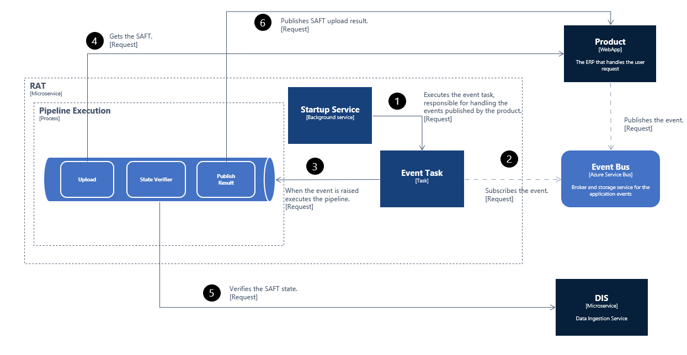

# Primavera.Lithium.RoseAsyncTasks

Provides asynchronous multi-task processing for ROSE applications or services that need to improve performance, scalability, and reusability. This component implements the asynchronous operation behavior in the PRIMAVERA Elevation Platform.

## RAT Architecture

The RAT microservice implements the Taskbox library to achieve the multi-task processing behavior. To know more about this feature see the [Primavera.Taskbox.](../../../ref/taskbox-1.0/Taskbox.md)

### `Pipelines`

#### `Upload SAFT`

The product will publish an event to the EventBus Azure, then the RAT microservice using the EventTask, component provided by the `Primavera.Taskbox`, subscribes to this event and when this is raised this task will execute the corresponding pipeline.

This pipeline is responsible for processing the SAFT asynchronously. This is composed of 3 handlers.

- `SAFTUploader` - responsible for obtaining the SAFT by performing an HTTP request to the specified address where the SAFT is stored;
- `SAFTVerifier` - responsible for asking the DIS microservice about the SAFT state;
- `SAFTPublisher` - publishes the SAFT upload request state to the specified address.

The following image describes the full process for this scenario.



#### `Intialize Subscription`

[UNDER DEVELOPMENT]

#### `SAFT Accounting`

[UNDER DEVELOPMENT]

### `Handlers`

These are handlers that were built to speed up and facilitate the process of building a pipeline. A handler is a piece of a pipeline, one pipeline is composed of n handlers.

#### `HTTPMultiWriterBase`

This handler's purpose is to write a given list of items. To accomplish this, the handler will perform several posts at the same time until the list of items runs out. The property "maxdegreeofparallelism" can configure the number of items that will be written at the same time.

To accomplish the multi-writer behavior you just need to implement the abstract Http MultiWriter class and override the necessary methods. The next example shows how to do that.

```Json
{
    "id": "example-multiwriter",
    "order": "1",
    "tag": "example-multiwriter",
    "type": "Primavera.Lithium.RoseAsyncTasks.WebApi.Handlers.ExampleMultiWriter, Primavera.Lithium.RoseAsyncTasks.WebApi",
    "configStr": "inputProperty=myinput; authorityserveruri=%authorityserveruri%; applicationscopes=%applicationscopes%; endpoint=%endpoint%; clientid=%clientid%; clientsecret=%clientsecret%; retryonfailure=true; retryattempts=3; minbackoff=0; maxbackoff=30; deltabackoff=2; maxdegreeofparallelism=50;",
    "active": "True"
}

```

```csharp

public class ExampleMultiWriter : HttpMultiWriter
{
    #region Constructor

    /// <summary>
    /// Initializes a new instance of the <see cref="ExampleMultiWriter"/> class.
    /// </summary>
    /// <param name="serviceProvider">The service provider.</param>
    public ExampleMultiWriter(IServiceProvider serviceProvider)
        : base(serviceProvider)
    {
    }

    #endregion

    /// <inheritdoc/>
    public override string BuildEndpoint()
    {
        return this.ConfigStr.GetValue<string>("endpoint");;
    }
}

```

#### `PublishResultBase{T}`

This handler purpose is to facilitate the process of publishing the pipeline final result to a given endpoint.

To build a pipeline result it's recommended that your result class inherit from the `ResultBase` in order to create a certain response pattern from the RAT micro-service.

```csharp

/// <summary>
/// Defines the pipeline result base class.
/// </summary>
public class ResultBase : DataTransferObject
{
    /// <summary>
    /// Gets or sets the title.
    /// </summary>
    public string Title
    {
        get
        {
            return this.GetValue<string>(nameof(this.Title));
        }

        set
        {
                this.SetValue(nameof(this.Title), value);
        }
    }

    /// <summary>
    /// Gets or sets the message.
    /// </summary>
    public string Message
    {
        get
        {
            return this.GetValue<string>(nameof(this.Message));
        }

        set
        {
                this.SetValue(nameof(this.Message), value);
        }
    }

    /// <summary>
    /// Gets or sets the status.
    /// </summary>
    public Status Status
    {
        get
        {
            return this.GetValue<Status>(nameof(this.Status));
        }

        set
        {
            this.SetValue(nameof(this.Status), value);
        }
    }
}
```

Consider the following example on how to implement the `PublishResultBase{T}` with a custom result class.

- Custom result class

```csharp

public sealed class MyCustomResult : ResultBase
{
    /// <summary>
    /// Gets or sets the my param.
    /// </summary>
    public string MyParam
    {
        get
        {
            return this.GetValue<string>(nameof(this.MyParam));
        }

        set
        {
            this.SetValue(nameof(this.MyParam), value);
        }
    }
}

```

- Implementing the `PublishResultBase{T}`

```csharp

public sealed class MyPublisher : PublishResultBase<MyResult>
{
    #region Constructor

    /// <summary>
    /// Initializes a new instance of the <see cref="MyPublisher"/> class.
    /// </summary>
    /// <param name="serviceProvider">The service provider.</param>
    public MyPublisher(IServiceProvider serviceProvider)
        : base(serviceProvider)
    {
    }

    #endregion

    #region Public Methods

    /// <inheritdoc/>
    public override string BuildEndpoint()
    {
        string endpoint = this.ConfigStr.GetValue<string>("endpoint");
    }

    /// <inheritdoc/>
    public override Task<MyResult> BuildPublishResultAsync(BaseContext context, CancellationToken cancellationToken)
    {
        MyResult myResult = this.Data.Responses.GetValue<MyResult>("myResult");

        return Task.FromResult(myResult);
    }

    #endregion
}

```

#### `VerifierBase`

The purpose of this handler is to facilitate the process of checking a given condition and only allow the pipeline flow to continue if the condition is true.

Consider the following example on how to implement the `VerifierBase`. The `HandleVerifyResultAsync` method is a virtual method and you should only override it if you want to perform some operation after the verification.

```csharp
public sealed class MyVerifier : VerifierBase
{
    #region Private Methods

    private readonly IServiceProvider serviceProvider;

    #endregion

    #region Constructor

    /// <summary>
    /// Initializes a new instance of the <see cref="MyVerifier"/> class.
    /// </summary>
    /// <param name="serviceProvider">The service provider.</param>
    public MyVerifier(IServiceProvider serviceProvider)
    {
        this.serviceProvider = serviceProvider;
    }

    #endregion

    #region Public Methods

    /// <inheritdoc/>
    public override async Task<bool> VerifyAsync(CancellationToken cancellationToken)
    {
        MyObject myobj = this.Data.Responses.GetValue<MyObject>("myobj");

        return myobj != null;
    }

    /// <inheritdoc/>
    public override Task HandleVerifyResultAsync(CancellationToken cancellationToken)
    {  
        return Task.CompletedTask;
    }

    #endregion
}

```
