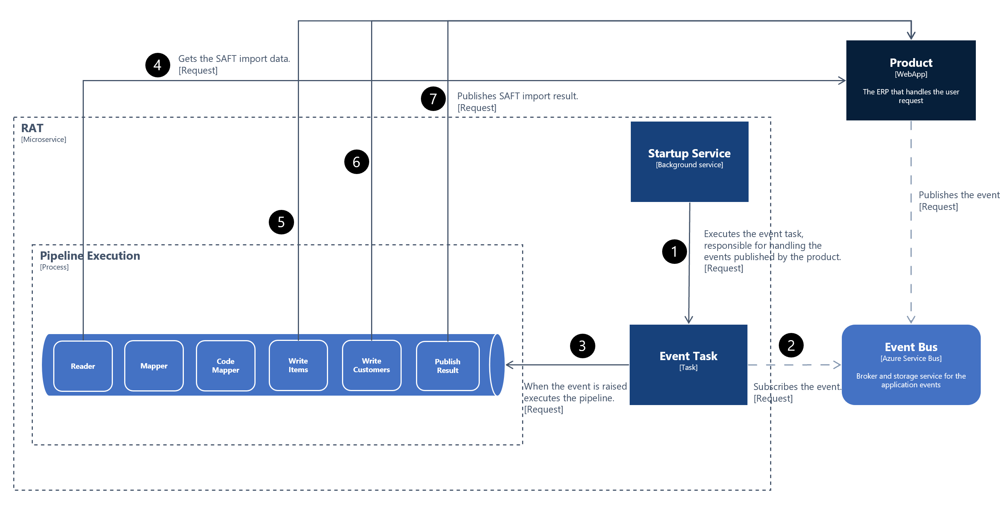
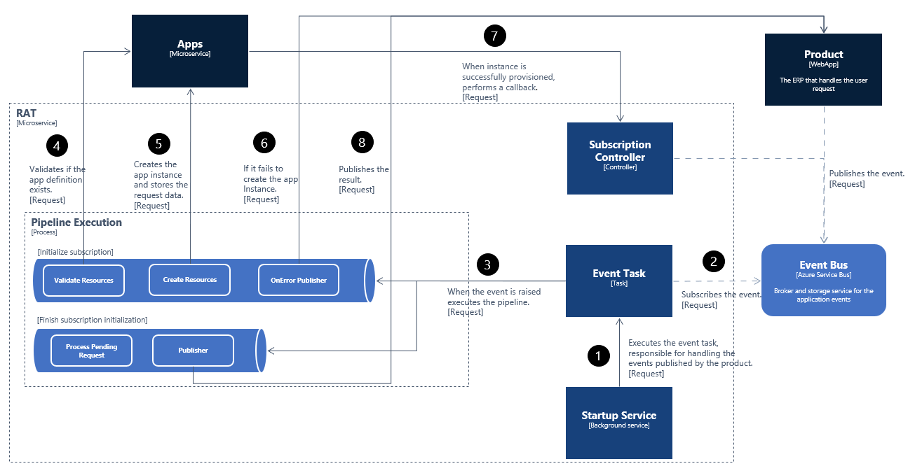
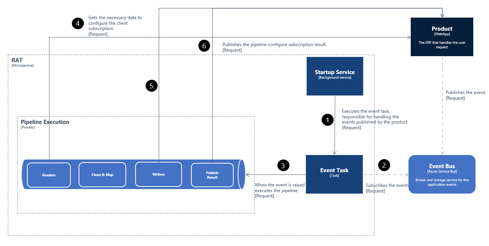

# ROSE Asynchronous Tasks Service (RAT) Specification v1.0

Provides asynchronous multi-task processing for ROSE applications or services that need to improve performance, scalability, and reusability. This component implements the asynchronous operation behavior in the PRIMAVERA Elevation Platform.

## Architecture

The RAT microservice implements the Taskbox library to achieve the multi-task processing behavior. To know more about this feature see the [Primavera.Taskbox.](../../../ref/taskbox-1.0/Taskbox.md)

### `Pipelines`

The product will publish an event to the EventBus Azure, then the RAT microservice using the EventTask, component provided by the `Primavera.Taskbox`, subscribes to this event and when this is raised this task will execute the corresponding pipeline.

#### `Upload SAFT`

This pipeline is responsible for processing the SAFT asynchronously. This is composed of 3 handlers.

- `SAFTUploader` - responsible for obtaining the SAFT by performing an HTTP request to the specified address where the SAFT is stored;
- `SAFTVerifier` - responsible for asking the DIS microservice about the SAFT state;
- `SAFTPublisher` - publishes the SAFT upload request state to the specified address.

The following image describes the full process for this scenario.


#### `SAFT Accounting`

This pipeline is responsible for processing the SAFT import data asynchronously. This is composed of 6 handlers.

- `SAFTImportReader` - responsible for obtaining the SAFT import data from the product;
- `SAFTImportMapper` - responsible for treating the SAFT import data and preparing this to be written;
- `SAFTImportCodeMapper` - verifies the customer creation key and based on that defines the party key value;
- `SAFTImportMultiWriter` - responsible for writing the items and customers in the product;
- `SAFTImportPublisher` - publishes the SAFT accounting result to the specified address.



#### `Initialize Subscription`

- `InitSubValidateResources` - responsible for validating the app definition;
- `InitSubCreateResources` - responsible for creating the app instance;
- `InitSubErrorPublisher` - responsible for publishing the result when the process of create resources has failed;
- `InitSubProcessPendingRequest` - responsible for obtaining the data for the initialize process based on the app instance key;
- `InitSubResultPublisher` - responsible for publishing the initialization result.



#### `Configure Subscription`

This pipeline is responsible for configuring a rose subscription asynchronously. This pipeline consists of 50 handlers of 4 types.

- `ConfigSubMultiReader` - responsible for performing read operations;
- `ConfigSubTransformer` - responsible for performing map, merge, clean and convert operations;
- `ConfigSubMultiWriter` - responsible for performing write operations;
- `ConfigSubPublisher` - responsible for writing the result to the product;



The first 18 handlers are readers, these use the `ConfigSubMultiReader` to achieve that kind of behavior. This handler implements the `ReaderBase` class.

`ConfigSubMultiReader`

Implements the `ReaderBase`. The parameters that can be configured, are the ones that follow:

|Parameter | Value | Description |
| :--------|:------| :-----------|
|isoDataReader| true, false |If, while building the endpoint, is necessary to include odata filters.|
|hasOdataFilter| true, false |If it has odata filters.|
|oDataFilter| text | The odata filters.|
|isCompanyReader| true, false |If it's true builds the endpoint with the necessary data to perform the request.|
|isAccountingGroupReader| true, false |If it's true builds the endpoint with the necessary data to perform the request.|
|isClientAccountingsReader| true, false |If it's true builds the endpoint with the necessary data to perform the request.|

> The read operations are performed in the following order:

- Gets the taxonomy classes;
- Gets the chart of accounts;
- Gets the GL accounts;
- Gets the ledgers;
- Gets the financial statements;
- Gets the financial calendars;
- Gets the client accoutings;
- Gets the accouting groups;
- Gets the customer parties;
- Gets the financial account determinations;
- Gets the customer posting profiles;
- Gets the sales account determinations;
- Gets the supplier posting profiles;
- Gets the purchases acct determinations;
- Gets the materials acct determinations;
- Gets the posting categories;
- Gets the tax report setups;
- Gets the with holding tax types;
- Gets the fiscal document types;
- Gets the item account types;

`ConfigSubTransformer`

The parameters that can be configured, are the ones that follow:

|Parameter | Value | Description |
| :--------|:------| :-----------|
|map| true, false |If it is to perform a map operation.|
|merge| true, false |If it is to perform a merge operation.|
|cleanUp| true, false |If it is to perform clean up operation.|
|cleanUpInlineArray| true, false |If it is to perform a cleanup array operation.|
|convertToItemsList| true, false |If it is to perform a convert to list operation.|
|inputProperty| text | The input property key.|
|mergeProperty| text | The merge property key.|
|mapPath| text | The map path.|
|isArray| true, false | If, the input data is an JSON array.|

> The tranform operations, such as convert, merge, map, clean, are performed in the following order:

- Trasnforms the fiscal document types data;
- Transforms customer input data;
- Transforms financial statements input data;
- Transforms financial calendars input data;
- Transforms with holding tax types input data;
- Transforms customer posting profiles input data;
- Transforms sales account determinations input data;
- Transforms supplier posting profiles input data;
- Transforms purchases acct determinations input data;
- Transforms materials acct determinations input data;
- Transforms tax report setups input data;
- Transforms item account types to generic sales item;

`ConfigSubMultiWriter`

Implements the `MultiWriterBase`. The parameters that can be configured are the ones defined in the base class.

> The write operations are performed in the following order:

- Writes the taxonomy classes;
- Writes the chart of accounts;
- Writes the GL accounts;
- Writes the ledgers;
- Writes the financial statements;
- Writes the financial calendars;
- Writes the client accoutings;
- Writes the accouting groups;
- Writes the customer parties;
- Writes the financial account determinations;
- Writes the customer posting profiles;
- Writes the sales account determinations;
- Writes the supplier posting profiles;
- Writes the purchases acct determinations;
- Writes the materials acct determinations;
- Writes the posting categories;
- Writes the tax report setups;
- Writes the with holding tax types;
- Writes the memo types;
- Writes the invoice types;
- Writes the generic sales item;

### `Handlers`

These are handlers that were built to speed up and facilitate the process of building a pipeline. A handler is a piece of a pipeline, one pipeline is composed of n handlers.

#### `ReaderBase`

This handler's purpose is to perform a "Get" request, a read operation. If the response has a next page, this handler can perform several requests until there are no remaining pages. Also, it will build the result by agglomerating the responses. The result will be added to the context with the "input Property" as key.

```Json
{
    "id": "example-reader",
    "order": "1",
    "tag": "example-reader",
    "type": "Primavera.Lithium.RoseAsyncTasks.WebApi.Handlers.ExampleReader, Primavera.Lithium.RoseAsyncTasks.WebApi",
    "configStr": "isPageReader=true; inputProperty=taxonomyclass; credentialsrequired=true; httpmethod=get; authorityserveruri=%authorityserveruri%; applicationscopes=%applicationscopes%; endpoint=%endpoint%; clientid=%clientid%; clientsecret=%clientsecret%; retryonfailure=true; retryattempts=3; minbackoff=0; maxbackoff=30; deltabackoff=2",
    "active": "True"
}

```

```csharp

public class ExampleReader: ReaderBase
{
    #region Constructor

    /// <summary>
    /// Initializes a new instance of the <see cref="ExampleReader"/> class.
    /// </summary>
    /// <param name="serviceProvider">The service provider.</param>
    public ExampleReader(IServiceProvider serviceProvider)
        : base(serviceProvider)
    {
    }

    #endregion

    /// <inheritdoc/>
    public override string SetRequestEndpoint()
    {
        return this.ConfigStr.GetValue<string>("endpoint");;
    }

}
```

|Parameter | Value | Description |
| :--------|:------| :-----------|
|isPageReader| true, false | If its true after each request it evaluates if the response has another page, If there is, this performs requests and agglomerates the data until there is no next page.|
|inputProperty| text | The input property key.|
|credentialsrequired| true, false |If, to perform the Http request, is necessary to have credentials this option should be defined has 'true'.|
|applicationscopes | ******|The application scopes that will be used to get the client credentials token.|
|authorityserveruri  | ****** |The address to get the client credentials token.|
|clientid| ******|The client id to get the client credentials token.|
|clientsecret  | ****** |The client secret to get the client credentials token.|
|endpoint| text |The request endpoint.|
|retryonfailure  |true, false| This option should be defined has 'true' if you want to activate the retry on failure.|
|retryattempts| n|The number of retry attempts.|
|minbackoff  | 0|Minimum exponential backoff value. |
|maxbackoff| 30|Maximum exponential backoff value.|
|deltabackoff  |2| Delta exponential backoff value.|

#### `MultiWriterBase`

This handler's purpose is to write a given list of items. To accomplish this, the handler will perform several posts at the same time until the list of items runs out. The property "maxdegreeofparallelism" can configure the number of items that will be written at the same time.

To accomplish the multi-writer behavior you just need to implement the abstract MultiWriterBase class and override the necessary methods. The next example shows how to do that.

```Json
{
    "id": "example-multiwriter",
    "order": "1",
    "tag": "example-multiwriter",
    "type": "Primavera.Lithium.RoseAsyncTasks.WebApi.Handlers.ExampleMultiWriter, Primavera.Lithium.RoseAsyncTasks.WebApi",
    "configStr": "inputProperty=myinput; authorityserveruri=%authorityserveruri%; applicationscopes=%applicationscopes%; endpoint=%endpoint%; clientid=%clientid%; clientsecret=%clientsecret%; retryonfailure=true; retryattempts=3; minbackoff=0; maxbackoff=30; deltabackoff=2; maxdegreeofparallelism=50;",
    "active": "True"
}

```

```csharp

public class ExampleMultiWriter : MultiWriterBase
{
    #region Constructor

    /// <summary>
    /// Initializes a new instance of the <see cref="ExampleMultiWriter"/> class.
    /// </summary>
    /// <param name="serviceProvider">The service provider.</param>
    public ExampleMultiWriter(IServiceProvider serviceProvider)
        : base(serviceProvider)
    {
    }

    #endregion

    /// <inheritdoc/>
    public override string SetEndpoint()
    {
        return this.ConfigStr.GetValue<string>("endpoint");;
    }

}

```

|Parameter | Value | Description |
| :--------|:------| :-----------|
|isArrayOrList| true, false |If, the payload is a list of items.|
|identifier| true, false |The key that identifies the element that will be written.|
|category| text | The category of the element that will be written.|
|inputProperty| text | The input property key.|
|credentialsrequired| true, false |If, to perform the Http request, is necessary to have credentials this option should be defined has 'true'.|
|applicationscopes | ******|The application scopes that will be used to get the client credentials token.|
|authorityserveruri  | ****** |The address to get the client credentials token.|
|clientid| ******|The client id to get the client credentials token.|
|clientsecret  | ****** |The client secret to get the client credentials token.|
|endpoint| text |The request endpoint.|
|retryonfailure  |true, false| This option should be defined has 'true' if you want to activate the retry on failure.|
|retryattempts| n|The number of retry attempts.|
|minbackoff  | 0|Minimum exponential backoff value. |
|maxbackoff| 30|Maximum exponential backoff value.|
|deltabackoff  |2| Delta exponential backoff value.|
|maxdegreeofparallelism  |10| The maximum of parallel write operations.|

#### `PublishResultBase{T}`

This handler purpose is to facilitate the process of publishing the pipeline final result to a given endpoint.

To build a pipeline result it's recommended that your result class inherit from the `ResultBase` in order to create a certain response pattern from the RAT micro-service.

```csharp

/// <summary>
/// Defines the pipeline result base class.
/// </summary>
public class ResultBase : DataTransferObject
{
    #region Constructor

    /// <summary>
    /// Initializes a new instance of the <see cref="ResultBase"/> class.
    /// </summary>
    public ResultBase()
    {
        this.Details = new List<Detail>();
    }

    #endregion

    /// <summary>
    /// Gets or sets the details.
    /// </summary>
    public IList<Detail> Details
    {
        get
        {
            return this.GetValue<IList<Detail>>(nameof(this.Details));
        }

        set
        {
            this.SetValue(nameof(this.Details), value);
        }
    }

    /// <summary>
    /// Gets or sets the status.
    /// </summary>
    public Status Status
    {
        get
        {
            return this.GetValue<Status>(nameof(this.Status));
        }

        set
        {
            this.SetValue(nameof(this.Status), value);
        }
    }
}
```

Consider the following example on how to implement the `PublishResultBase{T}` with a custom result class.

- Custom result class

```csharp

public sealed class MyCustomResult : ResultBase
{
    /// <summary>
    /// Gets or sets the my param.
    /// </summary>
    public string MyParam
    {
        get
        {
            return this.GetValue<string>(nameof(this.MyParam));
        }

        set
        {
            this.SetValue(nameof(this.MyParam), value);
        }
    }
}

```

- Implementing the `PublishResultBase{T}`

```csharp

public sealed class MyPublisher : PublishResultBase<MyResult>
{
    #region Constructor

    /// <summary>
    /// Initializes a new instance of the <see cref="MyPublisher"/> class.
    /// </summary>
    /// <param name="serviceProvider">The service provider.</param>
    public MyPublisher(IServiceProvider serviceProvider)
        : base(serviceProvider)
    {
    }

    #endregion

    #region Public Methods

    /// <inheritdoc/>
    public override string BuildEndpoint()
    {
        string endpoint = this.ConfigStr.GetValue<string>("endpoint");
    }

    /// <inheritdoc/>
    public override Task<MyResult> BuildPublishResultAsync(BaseContext context, CancellationToken cancellationToken)
    {
        return Task.FromResult(myResult);
    }

    #endregion
}

```

#### `VerifierBase`

The purpose of this handler is to facilitate the process of checking a given condition and only allow the pipeline flow to continue if the condition is true.

Consider the following example on how to implement the `VerifierBase`. The `HandleVerifyResultAsync` method is a virtual method and you should only override it if you want to perform some operation after the verification.

```csharp
public sealed class MyVerifier : VerifierBase
{
    #region Private Methods

    private readonly IServiceProvider serviceProvider;

    #endregion

    #region Constructor

    /// <summary>
    /// Initializes a new instance of the <see cref="MyVerifier"/> class.
    /// </summary>
    /// <param name="serviceProvider">The service provider.</param>
    public MyVerifier(IServiceProvider serviceProvider)
    {
        this.serviceProvider = serviceProvider;
    }

    #endregion

    #region Public Methods

    /// <inheritdoc/>
    public override async Task<bool> VerifyAsync(CancellationToken cancellationToken)
    {
        MyObject myobj = this.Data.Responses.GetValue<MyObject>("myobj");

        return myobj != null;
    }

    /// <inheritdoc/>
    public override Task HandleVerifyResultAsync(CancellationToken cancellationToken)
    {  
        return Task.CompletedTask;
    }

    #endregion
}

```

> Notice, that all the handlers have the possibility to break on error. This can be accomplished by adding the property `breakOnError=true` to the handler configuration.

### `Mapper`

To map you can use the `MapConfig` feature, which allows you to configure how and what properties will be mapped. This is composed of

- `ElementsToInclude`, the properties that you want to include in the output;
- `ElementsToExclude`, the properties that you want to exclude from the output;
- `ElementsToMerge`, the properties that you want to merge from other input;
- `Items`, the properties where you can customize the target document;

Consider the following example on how to use the `MapConfig`.

```csharp
MapConfig mapConfig = MapConfig.Create(myJSONConfig);

using JsonDocument doc = JsonDocument.Parse(inputJSON, new JsonDocumentOptions { AllowTrailingCommas = false });

JsonWriterOptions options = new JsonWriterOptions { Encoder = JavaScriptEncoder.UnsafeRelaxedJsonEscaping, Indented = true };

string outputJSON = mapConfig.Map(doc, options, Encoding.UTF8, true);
```

```Json
{
  "elementsToInclude": [
    "*"
  ],
  "elementsToExclude": [
    "description"
  ],
  "items": [
    {
      "target": "anotherElement",
      "customize": {
        "apply": false,
        "fixedValue": "fixed"
      }
    }
  ]
}

```

> Notice, that to use the `Customize` an item you have to set the "apply" to "true".
