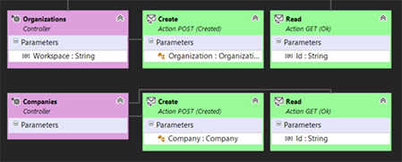
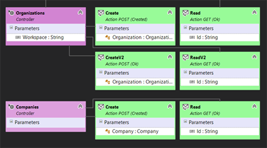
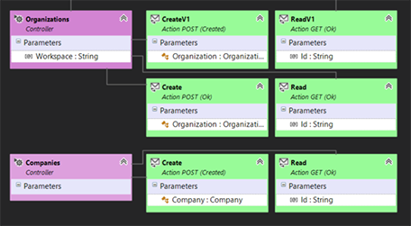

# How to add multiple versions to a microservice

This guide describes how to add versioning to a microservice.

Everytime you need to add a breaking change to a microservice Web API you should create a new version and decide on retro-compatibility of each of the endpoints present in the previous version.

The general rule of thumb is that you should never remove any public endpoints from the Web API. So, if you need to change something that would be a breaking change, you should add new endpoints to a new version of the API and keep all the old ones working.

Lithium microservices support versioning by including a middleware that deals with validating which versions are accepted by each endpoint (route).

The service designer allows configuring the API versions supported by the service and by each of its controllers and controller actions.

> The current level of support in the designer may not be sufficient to implement all scenarios.

## Scenario

For the purpose of this how to, consider that you have a very simple micro service, with two controllers and the following routes:

Controller `Organizations`:

- `GET /api/v{version:apiVersion}/organizations/{workspace}/{id}`
- `POST /api/v{version:apiVersion}/organizations/{workspace}`

Controller `Companies`:

- `GET /api/v{version:apiVersion}/companies/{id}`
- `POST /api/v{version:apiVersion}/companies`

This is version 1.0 of the API.

Now imagine that, for some reason, the tow actions in the `Organizations` controller should no longer require the `{workspace}` parameter.

You should create version 2.0 of the API and configure the service to support the two versions, ending up with:

Controller `Organizations`:

- `GET /api/v{version:apiVersion}/organizations/{workspace}/{id}` (version 1.0)
- `POST /api/v{version:apiVersion}/organizations/` (version 1.0)
- `GET /api/v{version:apiVersion}/organizations/{id}` (version 2.0)
- `POST /api/v{version:apiVersion}/organizations` (version 2.0)

Controller `Companies`:

- `GET /api/v{version:apiVersion}/companies/{id}` (versions 2.0 and 1.0)
- `POST /api/v{version:apiVersion}/companies` (versions 2.0 and 1.0)

> Notice that the actions in the `Companies` controller have no changes. It is desirable that these actions support both versions so that any caller could either use v1 or v2 of the client library without any problem.

## Modeling

The original model could look something like this:



> The service model version is 1.0. There is no other API version defined in the model.

### Adding the New API Version

The first thing to do is to add a new API version to the service model:

1. Change the service version to 2.0.
2. Using the context menu, add a new API Version and set its version to 1.0.

Now the service has two API versions (2.0 and 1.0), 2.0 is the default, and all controller actions would respond to requests using any of these versions.

### Creating the New Actions

The next step is to add the new controller actions to the model.

Select the `Organizations` controller and, using the context menu, add a new action:

| Property | Value |
| - | - |
| Name | `CreateV2` |
| Return Value Type | `String` |
| HTTP Method | `Post` |
| Success Status Code | `Created` |
| Ignore Controller Parameters | `true` |

Add a model parameter named `Organization` (referencing the `Organization` model) to this action.

Select the `Organizations` controller and add the new read action:

| Property | Value |
| - | - |
| Name | `ReadV2` |
| Return Value Type | `Model` |
| Return Value Model | `Organization` |
| HTTP Method | `Get` |
| Success Status Code | `OK` |
| Ignore Controller Parameters | `true` |

Finally, add a new scalar parameter named `Id` of type `String` to this action.

The model should now look like this:



## Configuring the API Versions

Lets start with the `Companies` controller.

Since we want all actions in this controller to accept version 2.0 and 1.0, you should proceed as follows:

1. Select the `Companies` controller and edit the `Versions` property.
2. Choose `All` and confirm.
3. Select each of the controller actions and edit the `Versions` property.
4. Choose `All` again for each action and confirm.

> You can simply leave the value of `Versions` blank if you prefer. This has the same effect of selecting `All`.

The `Organizations` controller will have actions accepting v2.0 and actions accepting v1.0. This means that the controller needs to accept both v2.0 and v1.0.

1. Select the `Organizations` controller and edit the `Versions` property.
2. Choose `All` and confirm.

`Create` and `Read` are the actions that were already in the model and that will accept v1.0:

1. Select the `Create` action and edit the `Versions` property.
2. Choose `1.0` and confirm.
3. Do the same for `Read`.

`CreateV2` and `ReadV2` are the new actions that we want to accept v2.0 only:

1. Select the `CreateV2` action and edit the `Versions` property.
2. Choose `2.0` and confirm.
3. Do the same for `ReadV2`.

That's it. You can now complete the microservice implementation - including the new actions and the behavior of the actions being "replaced" - and use the generated Postman collection to test this versioning behavior.

## Mind the Client Library

The generated client library will only include controllers and actions that support the latest version of the micro service API.

> It would not make sense for the new client library - the one for the new version of the API - to include deprecated operations.

For this example, this means that it would only include the following operations:

- `Organizations.CreateV2()`
- `Organizations.ReadV2()`
- `Companies.Create()`
- `Companies.Read()`

Can you see the problem resulting from the way that versioning was modeled with the previous instructions?

`CreateV2()` and `ReadV2()` are not good names for methods and in fact would have no meaning or purpose from the caller point-of-view, given that there are no `CreateV1()` or `ReadV1()` also. This is just bad design.

> The instructions above were meant exactly to point out that versioning a microservice ALSO requires thinking carefully of controller and actions names.

> Remember that you cannot have two actions of the same controller with the same name. There is a validation to prevent that in the service designer.

The most adequate way of modeling this scenario would be:

1. Rename the original actions `Create` to `CreateV1` and `Read` to `ReadV2`.
2. Name the new actions `Create` and `Read`.

The final service model would now be correct:



## Generated Code

### Web API Controllers

Notice how the API versions are set in the Web API controllers:

```csharp
[GeneratedCode("Lithium", "2.0")]
[ApiVersion("1.0")]
[ApiVersion("2.0")]
[SuppressMessage(...]
public abstract partial class CompaniesControllerBase : (...)
{
    (...)

    /// <inheritdoc />
    [ApiVersion("1.0")]
    [ApiVersion("2.0")]
    [HttpPost(...)]
    [ProducesResponseType(...)]
    [ProducesResponseType(...)]
    public virtual Task<IActionResult> CreateAsync([FromBody] Company company)
    {
        (...)
    }

    /// <inheritdoc />
    [ApiVersion("1.0")]
    [ApiVersion("2.0")]
    [HttpGet(...)]
    [ProducesResponseType(...)]
    public virtual Task<IActionResult> ReadAsync([FromRoute] string id)
    {
        (...)
    }

    (...)
}

[GeneratedCode("Lithium", "2.0")]
[ApiVersion("1.0")]
[ApiVersion("2.0")]
[SuppressMessage(...)]
public abstract partial class OrganizationsControllerBase : (...)
{
    (...)

    /// <inheritdoc />
    [ApiVersion("2.0")]
    [HttpPost(...)]
    [ProducesResponseType(...)]
    [ProducesResponseType(...)]
    public virtual Task<IActionResult> CreateAsync([FromBody] Organization organization)
    {
        (...)
    }

    /// <inheritdoc />
    [ApiVersion("1.0")]
    [HttpPost(...)]
    [ProducesResponseType(...)]
    [ProducesResponseType(...)]
    public virtual Task<IActionResult> CreateV1Async([FromRoute] string workspace, [FromBody] Organization organization)
    {
        (...)
    }

    /// <inheritdoc />
    [ApiVersion("2.0")]
    [HttpGet(...)]
    [ProducesResponseType(...)]
    [ProducesResponseType(...)]
    public virtual Task<IActionResult> ReadAsync([FromRoute] string id)
    {
        (...)
    }

    /// <inheritdoc />
    [ApiVersion("1.0")]
    [HttpGet(...)]
    [ProducesResponseType(...)]
    [ProducesResponseType(...)]
    public virtual Task<IActionResult> ReadV1Async([FromRoute] string workspace, [FromRoute] string id)
    {
        (...)
    }

    (...)
}

```

And how the client library only includes v2 operations:

```csharp
public partial interface ICompaniesOperations : IDisposable
{
    Task<ServiceOperationResult<string>> CreateAsync(
        Company company, 
        CancellationToken cancellationToken = default(CancellationToken));

    Task<ServiceOperationResult<Organization>> ReadAsync(
        string id, 
        CancellationToken cancellationToken = default(CancellationToken));
}

public partial interface IOrganizationsOperations : IDisposable
{
    Task<ServiceOperationResult<string>> CreateAsync(
        Organization organization, 
        CancellationToken cancellationToken = default(CancellationToken));

    Task<ServiceOperationResult<Organization>> ReadAsync(
        string id, 
        CancellationToken cancellationToken = default(CancellationToken));
}
```