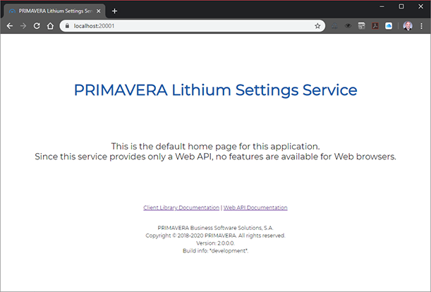

# How to add support for ASP.NET MVC user interface to a microservice

This guide describes the steps required to include ASP.NET MVC user interface in a microservice.

## MVC User Interface

By default, when you create a new microservice using the Lithium SDK, the microservice will include - out of the box - a very basic support for user interface using ASP.NET MVC.

### Home Page

The service home page is accessible from the base URI. It provides a very simple HTML page that facilitates several useful things:

- It acts as a monitoring endpoint. If the home page is rendered correctly, the service application is most likely also working correctly.
- It shows the service version (in the footer).
- It provides links to access the service Web API documentation and the service client library documentation (if available).



### Access Denied

The basic user interface also handles 403 (Forbidden) errors by showing a custom error view to the user.

### Error Handling

Any other error (e.g. 404, 500, etc.) resulting from operations that are not part of the microservice Web API, will also be presented in a custom error view.


### Generated Code

This basic MVC user interface is implemented in the generated code. It is useful to understand this generated code as it provides all the extensibility points required to customize it.

`StartupBase.ConfigureServices()`:

This method adds the MVC services, and the services required for the Web API and the client library documentation.

`StartupBase.AddMvc()`:

```csharp
protected virtual void AddMvc(IServiceCollection services, HostConfiguration hostConfiguration)
{
    // API controllers with views
    
    IMvcBuilder builder = services
        .AddApiControllersWithViews(
            (options) =>
            {
                // API versioning

                options.UseVersioning = true;
                options.DefaultApiVersion = (...);

                options.ConfigureApiVersioningOptions = 
                    this.ConfigureApiVersioningOptions;
            });

    // Custom configuration

    this.ConfigureMvc(services, builder, hostConfiguration);
}
```

> `ConfigureMvc()` is an extension point for `AddMvc()`. It is empty by default.

`StartupBase.AddOpenApiDocumentation()`:

```csharp
protected virtual void AddOpenApiDocumentation(IServiceCollection services, HostConfiguration hostConfiguration)
{
    // Default version

    services.AddOpenApiDocument(
        (options) =>
        {
            (...)
        });

    // Version 1.0

    services.AddOpenApiDocument(
        (options) =>
        {
            (...)
        });
}
```

`StartupBase.AddClientLibraryDocumentation()`:

```csharp
protected virtual void AddClientLibraryDocumentation(IServiceCollection services, HostConfiguration hostConfiguration)
{
    // Add markdown

    services.AddMarkdown();
}
```

`StartupBase.Configure()`:

This method configures the application and all the middleware.

> Notice how error handling is initialized in `UseErrorHandling()`.

`Configure()` also sets up request localization, support for static files, routing, endpoints, and the Web API and client library documentation.

`StartupBase.UseRequestLocalization()`:

```csharp
protected virtual void UseRequestLocalization(IApplicationBuilder app, HostConfiguration hostConfiguration)
{
    // Validation

    SmartGuard.NotNull(() => app, app);
    SmartGuard.NotNull(() => hostConfiguration, hostConfiguration);

    // Logging

    this.Logger.LogDebug($"Activating request localization...");

    // Options

    RequestLocalizationOptions options = new RequestLocalizationOptions()
    {
        DefaultRequestCulture = new RequestCulture(
            Constants.Localization.DefaultCulture),
        SupportedCultures = Constants.Localization.SupportedCulturesExtended,
        SupportedUICultures = Constants.Localization.SupportedCulturesExtended
    };

    // Add middleware

    app.UseRequestLocalization(options);
}
```

`StartupBase.UseStaticFiles()`:

```csharp
protected virtual void UseStaticFiles(IApplicationBuilder app, HostConfiguration hostConfiguration)
{
    // Validation

    SmartGuard.NotNull(() => app, app);
    SmartGuard.NotNull(() => hostConfiguration, hostConfiguration);

    // Logging

    this.Logger.LogDebug($"Activating static files...");

    // Add middleware

    app.UseStaticFiles();
}
```

`StartupBase.UseRouting()`:

```csharp
protected virtual void UseRouting(IApplicationBuilder app, HostConfiguration hostConfiguration)
{
    // Validation

    SmartGuard.NotNull(() => app, app);
    SmartGuard.NotNull(() => hostConfiguration, hostConfiguration);

    // Logging

    this.Logger.LogDebug($"Activating routing...");

    // Add middleware

    app.UseRouting();
}
```

`StartupBase.UseEndpoints()`:

 ```csharp
protected virtual void UseEndpoints(IApplicationBuilder app, HostConfiguration hostConfiguration)
{
    // Validation

    SmartGuard.NotNull(() => app, app);
    SmartGuard.NotNull(() => hostConfiguration, hostConfiguration);

    // Logging

    this.Logger.LogDebug($"Activating endpoint routing...");

    // Add middleware

    app.UseEndpoints(endpoints =>
    {
        // Map default controller route

        endpoints.MapControllerRoute("default", "{controller=Home}/{action=Index}/{id?}");

        // On Development environment

        if (this.CurrentEnvironment.IsDevelopment())
        {
            // Map route analyzer

            endpoints.MapRouteAnalyzer();

            // Map configuration analyzer

            endpoints.MapConfigurationAnalyzer();
        }
    });
}
```

`StartupBase.UseOpenApiDocumentation()`:

```csharp
protected virtual void UseOpenApiDocumentation(IApplicationBuilder app, HostConfiguration hostConfiguration)
{
    // Ignore Spelling: favicon
    // Ignore Spelling: img

    // Validation

    SmartGuard.NotNull(() => app, app);
    SmartGuard.NotNull(() => hostConfiguration, hostConfiguration);

    // Logging

    this.Logger.LogDebug($"Activating OpenAPI documentation...");

    // Add middleware to generate the schema

    app.UseOpenApi(
        (options) =>
        {
            (...)
        });

    // Add middleware to customize the UI

    app.UseWhen(
        context =>
        {
            return context.Request.PathIsWebApiDocumentationCustomization();
        },
        builder =>
        {
            builder.UseFileServer(
                new FileServerOptions()
                {
                    (...)
                });
        });

    app.UseWhen(
        context =>
        {
            return context.Request.PathIsWebApiDocumentation();
        },
        builder =>
        {
            builder.Use(
                async (context, next) =>
                {
                    (..)
                });
        });

    // Add middleware to build the UI

    app.UseSwaggerUi3(
        (options) =>
        {
            (...)
        });
}
```

`StartupBase.UseClientLibraryDocumentation()`:

```csharp
protected virtual void UseClientLibraryDocumentation(IApplicationBuilder app, HostConfiguration hostConfiguration)
{
    // Validation

    SmartGuard.NotNull(() => hostConfiguration, hostConfiguration);

    // Configure middleware

    app.UseMarkdown();
}
```

## Customizing the Home Page

The only way to customize the generated home page is to replace it with a completely new one. You cannot extend the generated `HomeView.gen.cshtml`.

To achieve that you will need to customize the behavior of the generated `HomeController`.

Start by creating a file named `HomeController.cs` in the `CustomCode` folder (under the `WebApi` project).

Implement a partial for the `HomeController` class and override the `Index()` method (the home controller action). Now you just need to return your new view, like in the following example:

```csharp
using System.Diagnostics.CodeAnalysis;
using System.Threading.Tasks;
using Microsoft.AspNetCore.Mvc;

namespace Primavera.Lithium.Settings.WebApi.Controllers
{
    [SuppressMessage("StyleCop.CSharp.DocumentationRules", "SA1601:PartialElementsMustBeDocumented")]
    public partial class HomeController
    {
        #region Public Methods

        /// <inheritdoc />
        public override Task<IActionResult> Index()
        {
            // Show the view

            return Task.FromResult<IActionResult>(
                this.View("~/CustomCode/Views/CustomHomeView.cshtml"));
        }

        #endregion
    }
}
```

## Adding Custom Views

You can add custom views and custom controller actions the same way you would do it to any other ASP.NET MVC project.

Start by adding a new controller in the `CustomCode` folder and then add the method for the new action.

```csharp
using Microsoft.AspNetCore.Mvc;

namespace Primavera.Lithium.Settings.WebApi.Controllers
{
    /// <summary>
    /// Defines a custom controller.
    /// </summary>
    [ControllerName("MyController")]
    public class MyController : Controller
    {
        #region Public Methods

        /// <summary>
        /// Shows the management view.
        /// </summary>
        /// <returns>The action result.</returns>
        [HttpGet("/management")]
        [ActionName("MyController.Management")]
        public IActionResult Management()
        {
            // Show the view

            return this.View("~/CustomCode/Views/Management.cshtml");
        }

        #endregion
    }
}
```

## Adding User Authentication

To have controller actions that require the user to sign-in with Identity Server you will need to configure the microservice to use OIDC (OpenID Connect) and the hybrid grant flow. The Lithium SDK service designer includes the settings required to achieve that.

1. Open the service model.
2. Open the properties window.
3. Edit the service configuration by clicking the ellipsis in the "Configuration" property.
4. Under "General", "Web API", check "Generate Support for OIDC".
5. Under "Clients", check "Use Hybrid Client" and specify a client id and a client secret.
6. Click OK.
7. Transform all projects.

The generated code will be modified accordingly.

`StartupBase.AddAuthentication()`:

The cookie authentication (`AddCookie()`) and OIDC (`AddOidc()`) authentication services are now added to the service collection.

```csharp
/// <summary>
/// Called to add authentication to the service collection.
/// </summary>
/// <param name="services">The service collection.</param>
/// <param name="hostConfiguration">The host configuration.</param>
/// <remarks>
/// The method is called from <see cref="ConfigureServices(IServiceCollection)"/>.
/// </remarks>
protected virtual void AddAuthentication(IServiceCollection services, HostConfiguration hostConfiguration)
{
    // Validation

    SmartGuard.NotNull(() => services, services);

    // Add authentication

    AuthenticationBuilder builder = services
        .AddAuthentication(
            (options) =>
            {
                options.DefaultScheme = OidcConstants.AuthenticationSchemes.Cookies;
                options.DefaultChallengeScheme = OidcConstants.AuthenticationSchemes.Oidc;
            });

    // Add Cookie

    this.AddCookie(services, builder, hostConfiguration);

    // Add OIDC

    this.AddOidc(services, builder, hostConfiguration);

    // Add JWT bearer

    this.AddJwtBearer(services, builder, hostConfiguration);
}
```

`StartupBase.AddOidc()`:

```csharp
/// <summary>
/// Called to add Cookie authentication to the service collection.
/// </summary>
/// <param name="services">The service collection.</param>
/// <param name="builder">The authentication builder.</param>
/// <param name="hostConfiguration">The host configuration.</param>
/// <remarks>
/// The method is called from <see cref="AddAuthentication(IServiceCollection, HostConfiguration)"/>.
/// </remarks>
protected virtual void AddCookie(IServiceCollection services, AuthenticationBuilder builder, HostConfiguration hostConfiguration)
{
    // Validation

    SmartGuard.NotNull(() => services, services);
    SmartGuard.NotNull(() => builder, builder);
    SmartGuard.NotNull(() => hostConfiguration, hostConfiguration);

    // Add

    builder
        .AddCookie(
            (options) =>
            {
                // Standard configuration

                options.AccessDeniedPath = Constants.Controllers.Home.Routes.AccessDenied;
                options.ReturnUrlParameter = options.ReturnUrlParameter?.Transform().ToLowerCase();

                options.Events = new Microsoft.AspNetCore.Authentication.Cookies.CookieAuthenticationEvents()
                {
                    OnRedirectToLogin = this.OnCookieRedirectToLogin,
                    OnRedirectToLogout = this.OnCookieRedirectToLogout,
                    OnSignedIn = this.OnCookieSignedIn,
                    OnSigningIn = this.OnCookieSigningIn,
                    OnSigningOut = this.OnCookieSigningOut,
                    OnValidatePrincipal = this.OnCookieValidatePrincipal,
                };

                // Custom configuration

                this.ConfigureCookieOptions(services, builder, options, hostConfiguration);
            });
}
```

`StartupBase.AddCookie()`:

```csharp
/// <summary>
/// Called to add OIDC authentication to the service collection.
/// </summary>
/// <param name="services">The service collection.</param>
/// <param name="builder">The authentication builder.</param>
/// <param name="hostConfiguration">The host configuration.</param>
/// <remarks>
/// The method is called from <see cref="AddAuthentication(IServiceCollection, HostConfiguration)"/>.
/// </remarks>
protected virtual void AddOidc(IServiceCollection services, AuthenticationBuilder builder, HostConfiguration hostConfiguration)
{
    // Validation

    SmartGuard.NotNull(() => services, services);
    SmartGuard.NotNull(() => builder, builder);
    SmartGuard.NotNull(() => hostConfiguration, hostConfiguration);

    // Add

    builder
        .AddOpenIdConnect(
            OidcConstants.AuthenticationSchemes.Oidc,
            (options) =>
            {
                // Standard configuration

                options.SignInScheme = OidcConstants.AuthenticationSchemes.Cookies;
                options.Authority = hostConfiguration.IdentityServerBaseUri?.Trim();
                options.RequireHttpsMetadata = false;
                options.ClientId = Constants.Credentials.Hybrid.ClientId;
                options.ClientSecret = Constants.Credentials.Hybrid.ClientSecret;
                options.ResponseType = OpenIdConnectResponseType.CodeIdTokenToken;
                options.SaveTokens = true;
                options.GetClaimsFromUserInfoEndpoint = true;

                options.Scope.Add(Primavera.Lithium.Api1.Models.Metadata.Scopes.Api1);
                options.Scope.Add(Primavera.Lithium.Api1.Models.Metadata.Scopes.Additional);
                options.Scope.Add(JwtClaimTypes.Email);
                options.Scope.Add(JwtClaimTypes.Profile);

                options.TokenValidationParameters = new TokenValidationParameters
                {
                    NameClaimType = "name",
                    RoleClaimType = "role"
                };

                options.Events = new Microsoft.AspNetCore.Authentication.OpenIdConnect.OpenIdConnectEvents()
                {
                    OnAuthenticationFailed = this.OnOidcAuthenticationFailed,
                    OnAuthorizationCodeReceived = this.OnOidcAuthorizationCodeReceived,
                    OnMessageReceived = this.OnOidcMessageReceived,
                    OnRedirectToIdentityProvider = this.OnOidcRedirectToIdentityProvider,
                    OnRedirectToIdentityProviderForSignOut = this.OnOidcRedirectToIdentityProviderForSignOut,
                    OnRemoteFailure = this.OnOidcRemoteFailure,
                    OnRemoteSignOut = this.OnOidcRemoteSignOut,
                    OnTicketReceived = this.OnOidcTicketReceived,
                    OnTokenResponseReceived = this.OnOidcTokenResponseReceived,
                    OnTokenValidated = this.OnOidcTokenValidated,
                    OnUserInformationReceived = this.OnOidcUserInformationReceived,
                };

                // Custom configuration

                this.ConfigureOidcOptions(services, builder, options, hostConfiguration);
            });
}
```

You will also need to add a new authorization policy to the model to force user authentication on the controller actions where that policy is applied.

1. Open the service model.
2. Using the context menu, add a new Authorization Policy.
3. Name it something like "AuthenticatedUser" and complete the other properties.
4. Save the model.
5. Transform all projects.

This adds the new authorization policy in the generated code.

`StartupBase.AddAuthorizationPolicies()`:

```csharp
/// <summary>
/// Called to add authorization policies to the service collection.
/// </summary>
/// <param name="options">The service collection.</param>
/// <param name="hostConfiguration">The host configuration.</param>
/// <remarks>
/// The method is called from <see cref="AddAuthorization(IServiceCollection, HostConfiguration)"/>.
/// </remarks>
protected virtual void AddAuthorizationPolicies(AuthorizationOptions options, HostConfiguration hostConfiguration)
{
    // Policy for default scope

    options.AddPolicy(
        Constants.Policies.Api1,
        (policy) =>
        {
            policy.AuthenticationSchemes = new List<string> 
            { 
                OidcConstants.AuthenticationSchemes.Bearer 
            };

            policy.RequireClaim(JwtClaimTypes.Scope, Primavera.Lithium.Api1.Models.Metadata.Scopes.Api1);
        });

    // Policies for authorization policies

    options.AddPolicy(
        Constants.Policies.AuthenticatedUser,
        this.ConfigureAuthenticatedUserPolicy);
}
```

You need to implement `ConfigureAuthenticatedUserPolicy()` in custom code:

```csharp
/// <inheritdoc />
protected override void ConfigureAuthenticatedUserPolicy(AuthorizationPolicyBuilder policy)
{
    // Validation

    SmartGuard.NotNull(() => policy, policy);

    // Requirements

    policy.RequireAuthenticatedUser();
}
```

The new policy can now be applied to any controller or controller action. When the user hits the corresponding routes, it will be prompted for sign-in.

Example:

```csharp
/// <summary>
/// Defines the interactive controller.
/// </summary>
/// <seealso cref="Microsoft.AspNetCore.Mvc.Controller" />
[ControllerName("Interactive")]
[Authorize(Policy = Constants.Policies.AuthenticatedUser)]
public partial class InteractiveController : Controller
{
    #region Actions

    /// <summary>
    /// Executes the action that shows the management overview.
    /// </summary>
    /// <returns>
    /// The action result.
    /// </returns>
    [HttpGet("/principal")]
    [ActionName("Interactive.GetPrincipal")]
    public async Task<IActionResult> GetPrincipalAsync()
    {
        (...)
    }

    #endregion
}
```

## Adding Custom Authorization Policies

You can add as many authorization policies to the service model as needed. These authorization policies can implement any requirement, not only the authenticated user requirement.

See the ASP.NET authorization policies documentation for more information on implementing custom requirements.