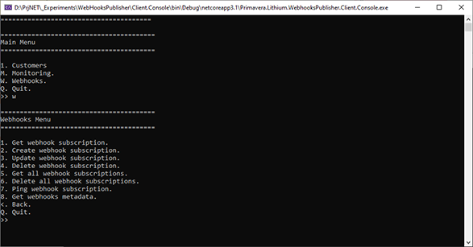

# How to publish webhooks from a  microservice

This guide describes how to setup a microservice to publish webhooks.

## Webhooks

Webhooks are automated messages sent to subscribers (applications or other microservices) when certain events occur within the publisher (the microservice) context.

Each webhook will have a payload - data about the event - associated with it.

To add webhooks to a microservice, first you need to describe the events available - so that subscribers can subscribe to receive the webhooks for those events - and then publish the actual events from microservice's custom logic.

## Adding webhooks

To describe the webhook events follow these steps:

1. Open the service model.
2. Using the context menu, add a new Webhook.
3. Specify the webhook name.
4. Add the summary, the event description, and the payload description.
5. Save the model and transform all text templates.

You can add as many webhooks as needed.

> The event name must be in the form 'Entity_Verb' to describe the entity affected and what happened. Example: 'Customer_Created'.

> The event and the payload descriptions are important so that the subscribers can understand what the event represents and what data they will receive when the webhook is triggered.

### Generated code

The generated code will be affected in multiple forms to add all the features associated with the webhooks.

#### Startup (webhooks services and webhooks events)

First, the microservice is setup to include the webhooks services and the descriptions for the webhooks events.

`StartupBase.ConfigureServices()`:

```csharp
public virtual void ConfigureServices(IServiceCollection services)
{
    // (...)

    // Webhooks

    this.AddWebhooks(services, hostConfiguration);

    // (...)
}
```

`StartupBase.AddWebhooks()`:

```csharp
protected virtual void AddWebhooks(IServiceCollection services, HostConfiguration hostConfiguration)
{
    // Validation

    SmartGuard.NotNull(() => services, services);
    SmartGuard.NotNull(() => hostConfiguration, hostConfiguration);

    // Webhooks

    services
        .AddWebhooks(this.ConfigureWebhooksOptions)
        .AddBackgroundQueuePublisher()
        .AddTimedRetry()
        .AddAzureTableStorage();
}
```

`StartupBase.ConfigureWebhooksOptions()`:

```csharp
/// <summary>
/// Called to configure the webhooks services options.
/// </summary>
/// <param name="options">The options.</param>
protected virtual void ConfigureWebhooksOptions(WebhooksOptions options)
{
    // Validation

    SmartGuard.NotNull(() => options, options);

    // Application name

    options.ApplicationName = "WHP";

    // Events supported

    options.EventsSupported = new List<WebhookEvent>()
    {
        new WebhookEvent()
        {
            EventName = "Customer_Created",
            EventDescriptions = new Dictionary<string, string>(StringComparer.OrdinalIgnoreCase)
            {
                ["en"] = this.GetResourceValueForCulture("RES_Webhook_Customer_Created_EventDescription", "en", typeof(WebhooksResources)),
                ["pt"] = this.GetResourceValueForCulture("RES_Webhook_Customer_Created_EventDescription", "pt", typeof(WebhooksResources)),
                ["es"] = this.GetResourceValueForCulture("RES_Webhook_Customer_Created_EventDescription", "es", typeof(WebhooksResources))
            },
            PayloadDescriptions = new Dictionary<string, string>(StringComparer.OrdinalIgnoreCase)
            {
                ["en"] = this.GetResourceValueForCulture("RES_Webhook_Customer_Created_PayloadDescription", "en", typeof(WebhooksResources)),
                ["pt"] = this.GetResourceValueForCulture("RES_Webhook_Customer_Created_PayloadDescription", "pt", typeof(WebhooksResources)),
                ["es"] = this.GetResourceValueForCulture("RES_Webhook_Customer_Created_PayloadDescription", "es", typeof(WebhooksResources))
            },
        }
    };
}
```

#### Controllers (webhooks subscriptions)

To allow for applications to subscribe the webhooks, the microservice will include a new set of API routes. These are implemented by the `WebhooksController`:

Here's an example of one of these controller actions:

```csharp
[Authorize(Constants.Policies.Webhooks)]
[HttpPost(Primavera.Lithium.WebhooksPublisher.Models.Metadata.Routes.Webhooks.CreateSubscription)]
[ProducesResponseType(typeof(ServiceError), (int)HttpStatusCode.BadRequest)]
[ProducesResponseType(typeof(ServiceError), (int)HttpStatusCode.Conflict)]
[ProducesResponseType(typeof(string), (int)HttpStatusCode.Created)]
public virtual async Task<IActionResult> CreateSubscriptionAsync(CreateWebhookSubscriptionRequest request)
{
    OperationResult validationResult = await this.ValidateSubscriptionRequestAsync(
        request)
        .ConfigureAwait(false);

    if (validationResult.IsFailure)
    {
        return this.BadRequest(
            ServiceError.FromOperationResult(
                validationResult));
    }

    OperationResult<string> result = await this.SubscriptionsService
        .CreateSubscriptionAsync(
            request)
        .ConfigureAwait(false);

    if (result.IsFailureWith(WebhooksErrorCodes.EventAlreadySubscribed))
    {
        return this.Conflict(
            ServiceError.FromOperationResult(
                result));
    }
    else if (result.IsFailure)
    {
        return this.BadRequest(
            ServiceError.FromOperationResult(
                result));
    }

    return this.Created(
        this.HttpContext.Request.GetWebhookSubscriptionLocationUri(
            request.ClientId, 
            result.Data),
        result.Data);
}

protected virtual Task<OperationResult> ValidateSubscriptionRequestAsync(CreateWebhookSubscriptionRequest request)
{
    return Task.FromResult(
        OperationResult.Success());
}
```

Notice the following aspects of this controller action:

- The action uses OAuth authorization with a policy named `Webhooks` that enforces the client application to provide a specific scope (see Authorization, below).
- The Webhooks controller reuses the `IWebhooksSubscriptionService` provided by Hydrogen.
- All the webhooks subscriptions routes start with `/api/webhooks`.
- The client application can validate and/or customize the incoming requests from client applications via the `ValidateSubscriptionRequestAsync()` method (see Validation bellow).

##### Authorization

All webhooks routes are secured by a policy that requires the caller to provide the `Models.Metadata.Scopes.Webhooks` scope. This scope's name is automatically generated from the micro service default scope by adding the `-wh` suffix. It that default scope is, for example, `identityserver4`, the Webhooks scope will be `identityserver4-wh`.

This allows for a more fine-grained tuning of authorization. A client application that has access to the micro service API (the default scope) may not be allowed to subscribe and receive webhooks.

##### Validation

The `ValidateSubscriptionRequestAsync()` permits implementing custom logic to validate incoming subscription requests (create or update). It also allows customizing the requests by complementing them with application-specific logic, like in the following example:

```csharp
protected virtual async Task<OperationResult> ValidateSubscriptionRequestAsync(CreateWebhookSubscriptionRequest request)
{
    string clientId = request.ClientId;

    string subscription = await this.FindSubscriptionForClientAsync(clientId).ConfigureAwait(false);
    if (string.IsNullOrEmpty(subscription))
    {
        return OperationResult.Failure(
            new OperationError(
                "OperationNotAllowed",
                "Operation is not allowed because the client id is not recognized."
            ));
    }

    request.Filters = Dictionary<string, string>()
    {
        ["Subscription"] = subscription
    };

    return OperationResult.Success();
}
```

#### Client library (webhooks subscriptions)

This new controller is also exposed in the microservice client library. This means that applications will be able to use the client library to subscribe the webhooks events.

```csharp
/// <summary>
/// Defines the base class for the type that manages webhooks on the service.
/// </summary>
/// <seealso cref="IWebhooksOperations" />
/// <seealso cref="IDisposable" />
[GeneratedCode("Lithium", "2.0")]
[SuppressMessage("Maintainability Rules", "SA1402:FileMayOnlyContainASingleType", Justification = "Because of code generation design.")]
public abstract partial class WebhooksOperationsBase : IWebhooksOperations, IDisposable
{
    // (...)
}
```

#### Console client (webhooks subscriptions)

The console client also provides operations on this new controller, like it happens for the monitoring controller:



## Publishing webhooks events

Now that the microservice is configured to use the webhooks services and includes the webhooks events' descriptions, the only thing missing is to publish the actual webhooks in the correct places.

This cannot be automatically generated, so it needs to be placed in the appropriate custom logic spot, which depends, off course, on the nature of the microservice and on the event itself.

To publish an event, you should use the `IWebhooksService` as in the following example:

```csharp
private IWebhooksService WebhooksService
{
    get
    {
        return this.HttpContext.RequestServices.GetRequiredService<IWebhooksService>();
    }
}

CustomerPayload payload = new CustomerPayload()
{
    (...)
};

await this.WebhooksService.PublishEventAsync(
    "Customer_Created",
    payload)
    .ConfigureAwait(false);
```

> The publisher can also provide filters to customize whose subscribers match the event. For more information see [AspNetCore.Webhooks.Abstractions](../ref/hydrogen-2.0/AspNetCore.Webhooks.Abstractions.md).