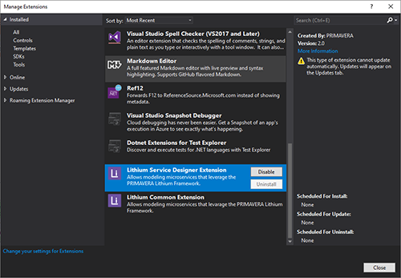

# How to setup the development environment to use the Lithium Framework

This guide describes how development environments need to be configured to use the Lithium Framework. 

To use the Lithium Framework to its full extent you will need the following components installed in the development machine.

## Visual Studio 2019

Install a version of **Visual Studio 2019 greater than 16.3.0** (so it includes support for .NET Core 3.0).

The following workloads and components are required:

- ASP.NET and web development
    - .NET Core 3.0 SDK
- Azure development
- Visual Studio extension development
    - Modeling SDK
    - .NET Compiler Platform SDK
- .NET Core cross-platform development

## Lithium SDK

Install the **latest version of the Lithium SDK** using the setup available in the internal storage.

After installed, two new extensions with the following names should be available in Visual Studio 2019:

- Lithium Service Designer Extension
- Lithium Common Extension

## Required Services

To compile the microservice developed with the Lithium Framework, access to the following internal services will also be necessary:

- NuGet packages repository: [public-lithium-general](http://nuget.primaverabss.com:82/feeds/public-lithium-general)

## Additional Services

To fully integrate the microservices developed with the Lithium Framework in the company's CI/CD pipeline, access to the following internal services will also be necessary:

- Source control
- Builds management
- Releases management

## Optional Components

The following extensions for Visual Studio are recommended but not required:

- GhostDoc Community - for editing XML documentation comments.
- Visual Studio Spell Checker - for spell checking code.
- Markdown Editor - for editing markdown (md) files.

The following applications are also recommended:

- Visual Studio Code - for editing documentation markdown files (like this one) from Git.
- Fork - a Windows client for Git.