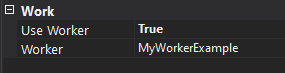

# How to subscribe new notifications events on EventBus (PNS)

## Getting started 

If needed, a new subscriber can be created to listen another events from eventbus. To add the listener to another new type you should do:
* Create a background worker (in the Service Model);
* Create a background service (in the Service Model);
* Go to the service properties, and add the worker to the service:



* Create the partial worker class in the BackgrounServices folder. This class should inject the IEventBusManager via Dependency Injection:

```c#
private IEventBusManager EventBusManager
{
    get
    {
        return this.ServiceProvider.GetRequiredService<IEventBusManager>();
    }
}
```
* Add the class as a ```Singleton``` in the startup on the method ```DependencyInjection(IServiceCollection services)```:

```c#
services.AddSingleton<YourEventBusListenerWorker>()
```
* Create the partial service class in the BackgrounServices folder.
* On the background service, override the ```YourEventBusListenerWorker``` like:

```c#
internal partial class MyServiceExampleService
{
    /// <summary>
    /// Gets the instance of the background worker that should executed.
    /// by the background service.
    /// </summary>
    public override MyWorkerExampleWorker Worker
    {
        get
        {
            return this.ServiceProvider.GetRequiredService<MyWorkerExampleWorker>();
        }
    }
}
```
* Go to the IEventBusManager (Contracts/IEventBusManager.cs) and add your subscribe method;
* Go to the EventBusManager (Managers/EventBusManager.cs) and implement your subscribe method;
> Note: You can read more about EventBus subscribe/unsubscribe implementation [here.](https://github.com/PrimaveraDeveloper/lithium/blob/master/ref/hydrogen-2.0/EventBus.Azure.md#subscribing-to-events)
* On the worker class, override the method ```ExecuteAsync``` and call your new method from EventBus:

```c#
public override async Task ExecuteAsync(CancellationToken cancellationToken)
{
    await this.EventBusManager.SubscribeToYourEvent().ConfigureAwait(false);
}
```
* In the Handlers folder, create your handler class like:
```c#
public class YourEventHandler : IEventBusEventHandler<YourDataType>
{
	public async Task<bool> Handle(IEventBusEvent<YourDataType> eventBusEvent)
	{
		// handle the event here
	}
}
```
> Note: You can inject other services in your handler class, like NotificationsManager:

```c#
private INotificationsManager NotificationsManager
{
    get
    {
        return this.serviceProvider.GetRequiredService<INotificationsManager>();
    }
}
```

> Important: The topic which the EventBus will subscribe must be already created on the Azure!

## Full example

### Worker and Service modeling


### Worker class

```c#
internal partial class MyWorkerExampleWorker
{
    private IEventBusManager EventBusManager
    {
        get
        {
            return this.ServiceProvider.GetRequiredService<IEventBusManager>();
        }
    }

    /// <summary>
    /// Executes the worker.
    /// </summary>
    /// <param name="cancellationToken">The cancellation token. This token signals that the background worker is being stopped.</param>
    /// <returns>
    /// The <see cref="T:System.Threading.Tasks.Task" /> that represents the asynchronous operation.
    /// </returns>
    public override async Task ExecuteAsync(CancellationToken cancellationToken)
    {
        await this.EventBusManager.SubscribeToYourEvents().ConfigureAwait(false);
    }
}
```

### Service class
```c#
internal partial class MyServiceExampleService
{
    /// <summary>
    /// Gets the instance of the background worker that should executed.
    /// by the background service.
    /// </summary>
    public override MyWorkerExampleWorker Worker
    {
        get
        {
            return this.ServiceProvider.GetRequiredService<MyWorkerExampleWorker>();
        }
    }
}
```

### Startup (DependencyInjection method)
```c#
private void DependencyInjection(IServiceCollection services)
{
    this.InitializeCosmosClientInstance(services);

    services.AddSingleton<EventBusListenerWorker>()
    .AddSingleton<IEventBusManager, EventBusManager>()
    .AddSingleton<INotificationsManager, NotificationsManager>()
    .AddSingleton<MyWorkerExampleWorker>();

    services.AddLogging();
}
```

### IEventBusManager & EventBusManager

```c#
public interface IEventBusManager
{
    #region Methods

    /// <summary>
    /// Subscribes to example events.
    /// </summary>
    /// <returns><see cref="System.Threading.Tasks.Task"/> representing the operation.</returns>
    public Task SubscribeToYourEvents();

    #endregion
}
```

```c#
public class EventBusManager : IEventBusManager
    {
        #region Fields

        /// <summary>
        /// The service provider.
        /// </summary>
        private readonly IServiceProvider serviceProvider;

        #endregion

        #region Private Properties

        private AzureConfiguration AzureConfiguration
        {
            get
            {
                return this.serviceProvider.GetRequiredService<AzureConfiguration>();
            }
        }

        /// <summary>
        /// Gets the event bus.
        /// </summary>
        /// <value>The event bus.</value>
        private IEventBusService EventBus
        {
            get
            {
                return this.serviceProvider.GetRequiredService<IEventBusService>();
            }
        }

        #endregion

        #region Constructors

        /// <summary>
        /// Initializes a new instance of the <see cref="EventBusManager"/> class.
        /// </summary>
        /// <param name="serviceProvider">The service provider.</param>
        public EventBusManager(IServiceProvider serviceProvider)
        {
            this.serviceProvider = serviceProvider;
        }

        #endregion

        #region Public Methods

        /// <summary>
        /// Subscribes to example events.
        /// </summary>
        /// <returns>A <see cref="Task"/> representing the asynchronous operation.</returns>
        public async Task SubscribeToYourEvents()
        {
            try
            {
                IEventBusEventHandler<string> exampleEventHandler = new EventHandlerExample(this.serviceProvider);

                IEventBusEventFilters<string> exampleEventFilters = new AzureEventBusEventFilters<string>();

                // Add custom filters from settings

                exampleEventFilters.Filters.Add("Version", "1.0");
                exampleEventFilters.Filters.Add("Channel", "PublicPrimavera");

                await this.EventBus.SubscribeAsync("public-pns", exampleEventHandler, exampleEventFilters).ConfigureAwait(false);
            }
            catch (EventBusServiceException)
            {
                throw;
            }
        }

        #endregion
    }
```

### Handler class
```c#
public class EventHandlerExample : IEventBusEventHandler<string>
{
    /// <summary>
    /// The service provider.
    /// </summary>
    private readonly IServiceProvider serviceProvider;

    /// <summary>
    /// Gets the logger.
    /// </summary>
    /// <value>The logger.</value>
    private ILogger<EventHandlerExample> Logger
    {
        get
        {
            return this.serviceProvider.GetRequiredService<ILogger<EventHandlerExample>>();
        }
    }

    /// <summary>
    /// Initializes a new instance of the <see cref="EventHandlerExample"/> class.
    /// </summary>
    /// <param name="serviceProvider">The service provider.</param>
    public EventHandlerExample(IServiceProvider serviceProvider)
    {
        this.serviceProvider = serviceProvider;
    }

    /// <summary>
    /// Handles the specified received event.
    /// </summary>
    /// <param name="eventBusEvent">The received event.</param>
    /// <returns>True if processed successfully.</returns>
    public async Task<bool> Handle(IEventBusEvent<string> eventBusEvent)
    {
        // Check if not null

        SmartGuard.NotNull(() => eventBusEvent, eventBusEvent);

        this.Logger.LogInformation("Received event bus event.");

        this.Logger.LogInformation("Received message: ", eventBusEvent.Body);

        // Example async operation

        await Task.Yield();

        // Return success to the eventBus

        return true;
    }
}
```