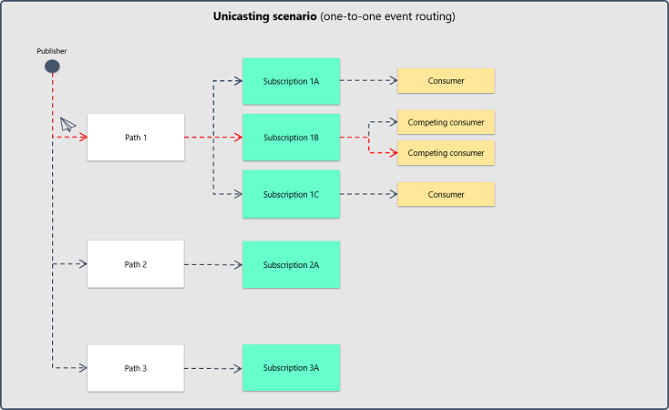
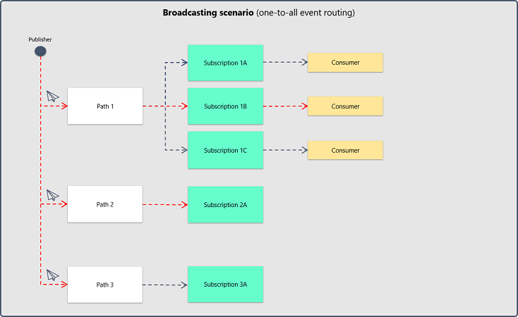

# Primavera.Hydrogen.EventBus.Azure

**Class library that contains types that define generic event bus services that use Microsoft Azure Service Bus.**

This class library is a concrete implementation of the [Primavera.Hydrogen.EventBus](EventBus.Abstractions.md) abstractions that uses [Microsoft Azure Service Bus](https://docs.microsoft.com/pt-pt/azure/service-bus-messaging/service-bus-messaging-overview).

## Service options

The `AzureEventBusOptions` entity defines the configuration for both publication and subscription operations. The below table provides a brief description of each property of the entity:

| Property                        | Description                                                                                                                                                           | Optional? |
| ------------------------------- | --------------------------------------------------------------------------------------------------------------------------------------------------------------------- | --------- |
| ConnectionString                | The Azure Service Bus instance connection string.                                                                                                                     | No.       |
| EventHandler.AutoComplete       | Flag that defines if a received event will be marked as processed as soon as it arrives to the client.                                                                | No.       |
| EventHandler.MaxConcurrentCalls | The maximum number of concurrent calls to the Azure Service Bus instance.                                                                                             | No.       |
| RetryStrategy                   | The [exponential back-off retry strategy](Core.md#retry-strategies) to be applied to the Azure Service Bus instance. If null, a default strategy will be implemented. | Yes.      |
| RetryStrategy.RetryCount        | The maximum number of retry attempts.                                                                                                                                 | Yes.      |
| RetryStrategy.MinBackoff        | The minimum backoff time.                                                                                                                                             | Yes.      |
| RetryStrategy.MaxBackoff        | The maximum backoff time.                                                                                                                                             | Yes.      |
| RetryStrategy.DeltaBackoff      | The value that will be used to calculate a random delta in the exponential delay.                                                                                     | Yes.      |

## Implementing the service

The service implementation should be registered using the `AddAzureEventBus` extension method for `IServiceCollection`.

The extension method expects an `AzureEventBusOptions` entity as an argument.

```csharp
/// <summary>
/// Gets the event bus service.
/// </summary>
/// <returns>The event bus service.</returns>
private static IEventBusService GetEventBusService()
{
    IServiceCollection services = new ServiceCollection();

    services.AddAzureEventBus(
        (options) =>
        {
            options.ConnectionString = "my-connection-string";
            options.EventHandler = new EventHandlerOptions(autoComplete: false, maxConcurrentCalls: 10);
            options.RetryStrategy = new ExponentialBackoffRetryStrategy();
        });

    return services.BuildServiceProvider().GetRequiredService<IEventBusService>();
}
```

## Publishing an event

In order to publish an event, a typed `AzureEventBusEvent` entity needs to be instantiated. The entity must be serializable through `System.Text.Json`.

The respective `AzureEventBusEvent` entity should then be passed as an argument to the `Publish` or `PublishAsync` method of the `AzureEventBusService` instance.

If a path is specified in the `Publish` or `PublishAsync` method, the event will be sent as a [unicast](https://en.wikipedia.org/wiki/Unicast) to the respective path. Otherwise, the event will be [broadcasted](https://en.wikipedia.org/wiki/Broadcasting_(networking)) to all the existing paths in the event bus service.





```csharp
/// <summary>
/// Publishes, as a broadcast to all the event bus service paths, an event containing a versioned message.
/// </summary>
/// <param name="eventBus">The event bus.</param>
private static void BroadcastVersionedMessageEvent(IEventBusService eventBus)
{
    string myMessage = "Hack the planet!";

    IEventBusEvent<string> @event = new AzureEventBusEvent<string>()
    {
        Body = myMessage // Since we are typing the event as a string, we need to provide a string to the event body.
    };

    @event.Properties.Add("Version", "1");

    eventBus.Publish(@event);
}
```

## Subscribing to events

The event subscription operation involves the creation of a method capable of handling incoming events for a given type.

```csharp
/// <summary>
/// Handles the specified <see cref="IEventBusEvent{T}"/>.
/// </summary>
/// <typeparam name="T">The event type.</typeparam>
/// <param name="event">The event.</param>
/// <returns>The <see cref="Task"/> representing the operation.</returns>
private static Task<bool> HandleAsync<T>(IEventBusEvent<T> @event)
{
    try
    {
        SmartGuard.NotNull(() => @event, @event);

        Console.WriteLine(@event.Body);

        return Task.FromResult(true);
    }
    catch (EventBusServiceException e)
    {
        Console.WriteLine($"\nException has been raised: '{e.Message}'.");

        return Task.FromResult(false);
    }
}
```

The subscription source path and a delegate representing the handling method previously created should then be passed to the `Subscribe` or `SubscribeAsync` method of the `AzureEventBusService` instance.

A collection of subscription filters defined by `IEventBusFilters` can also be provided.

```csharp
/// <summary>
/// Subscribes versioned message events.
/// </summary>
/// <param name="eventBus">The event bus.</param>
private static void SubscribeVersionedMessageEvents(IEventBusService eventBus)
{
    EventBusHandlerDelegate<string> messageHandler = HandleAsync;

    IEventBusFilters<string> messageFilters = new AzureEventBusFilters<string>();

    messageFilters.Filters.Add("Version", "1");

    eventBus.Subscribe("my-path", messageHandler, messageFilters);
}
```

The **type of the event in conjunction with the subscription filters** are then used to correlate the events that should be sent to the subscriber.

As can be seen in the above example, events with the **logical conjunction** of the following characteristics are being subscribed:

- Events of `string` type;
- Originated from *my-path* path;
- Where a event property with key *Version* and value *1* exists.

The logical conjunction is obtained through hashing operations. Be aware that different subscriptions filters will result in distinct hashes.

## Unsubscribing from events

Unsubscribing from an event type is done by invoking the `Unsubscribe` or `UnsubscribeAsync` method of an `AzureEventBusService` with the subscription source path and the respective `T`.

A collection of subscription filters defined by `IEventBusFilters` can also be provided.

```csharp
/// <summary>
/// Unsubscribes from versioned message events.
/// </summary>
/// <param name="eventBus">The event bus.</param>
private static void UnsubscribeVersionedMessageEvents(IEventBusService eventBus)
{
    IEventBusFilters<string> messageFilters = new AzureEventBusFilters<string>();

    messageFilters.Filters.Add("Version", "1");

    eventBus.Unsubscribe("my-path", messageFilters);
}
```

## Service management

The service structural entities (such as paths) should be provisioned using the respective management service.

The management service can be registered thought the `AddAzureEventBusManager` extension method for `IServiceCollection`.

The extension method also expects an `AzureEventBusOptions` entity as an argument.

## Service redundancy

Short lived outages are mitigated thought the [exponential back-off retry strategy](Core.md#retry-strategies) that this library implements.

In order to mitigate long lived outages or even disasters, a service that consumes this library should expose a monitoring endpoint that is able to probe the health status of the respective cloud message broker instance.

## Remarks

In order to ease the development process with this service, it is recommended the usage of [Service Bus Explorer](https://github.com/paolosalvatori/ServiceBusExplorer).

Service Bus Explorer facilitates the debugging process and provides a good way to understand the concrete dynamics of this service.
