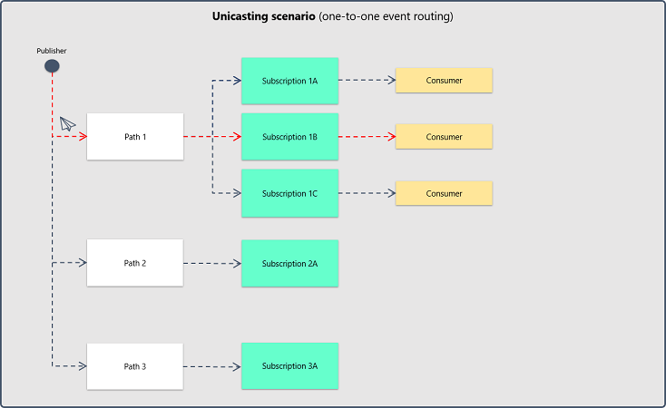
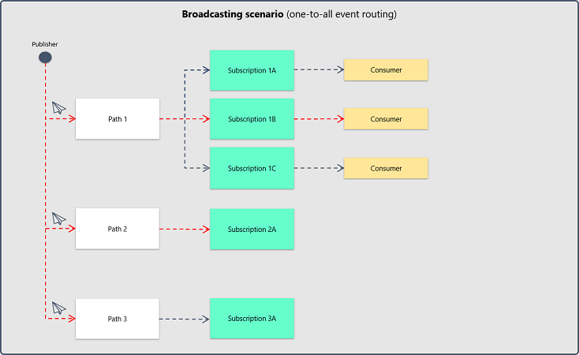

# Primavera.Hydrogen.EventBus.InMemory

**Class library that contains types that define generic event bus services that use an in-memory implementation.**

## Service options

The `InMemoryEventBusOptions` entity defines the configuration for both publication and subscription operations. The below table provides a brief description of each property of the entity:

| Property | Description                                                                                                                        | Optional? |
|----------|------------------------------------------------------------------------------------------------------------------------------------|-----------|
| Strategy | The strategy to be applied to the service: multi-threaded, single-threaded or single-threaded with parallel subscriber execution.  | No.       |

## Implementing the service

The service implementation should be registered using the `AddInMemoryEventBus` extension method for `IServiceCollection`.

The extension method expects an `InMemoryEventBusOptions` entity as parameter.

```csharp
/// <summary>
/// Gets the event bus service.
/// </summary>
/// <returns>The event bus service.</returns>
private static IEventBusService GetEventBusService()
{
    IServiceCollection services = new ServiceCollection();

    services.AddInMemoryEventBus(
        (options) =>
        {
            options.Strategy = InMemoryEventBusStrategy.MultiThreaded;
        });

    return services.BuildServiceProvider().GetRequiredService<IEventBusService>();
}
```

## Publishing an event

In order to publish an event, a typed `InMemoryEventBusEvent` entity needs to be instantiated.

The respective `InMemoryEventBusEvent` entity should then be passed as an argument to the `Publish` or `PublishAsync` method of the `InMemoryEventBusService` instance.

If a path is specified in the `Publish` or `PublishAsync` method, the event will be sent as a [unicast](https://en.wikipedia.org/wiki/Unicast) to the respective path. Otherwise, the event will be [broadcasted](https://en.wikipedia.org/wiki/Broadcasting_(networking)) to all the existing paths in the event bus service.





```csharp
/// <summary>
/// Publishes, as a broadcast to all the event bus service paths, an event containing a versioned message.
/// </summary>
/// <param name="eventBus">The event bus.</param>
private static void BroadcastVersionedMessageEvent(IEventBusService eventBus)
{
    string myMessage = "Hack the planet!";

    IEventBusEvent<string> @event = new InMemoryEventBusEvent<string>()
    {
        Body = myMessage // Since we are typing the event as a string, we need to provide a string to the event body.
    };

    @event.Properties.Add("Version", "1");

    eventBus.Publish(@event);
}
```

## Subscribing to events

The event subscription operation involves the creation of a typed handler class, implemented through the `IEventBusEventHandler`, that will be responsible for handling incoming events of the same type.

```csharp
/// <summary>
/// The message event handler.
/// </summary>
/// <seealso cref="Primavera.Hydrogen.EventBus.IEventBusEventHandler{T}"/>
public class MessageEventHandler : IEventBusEventHandler<string>
{
    #region Constructors

    /// <summary>
    /// Initializes a new instance of the <see cref="MessageEventHandler"/> class.
    /// </summary>
    public MessageEventHandler()
    {
    }

    #endregion

    #region Public Methods

    /// <summary>
    /// Handles the specified message event.
    /// </summary>
    /// <param name="eventBusEvent">The message event.</param>
    /// <returns>Boolean according execution success.</returns>
    public Task<bool> HandleAsync(IEventBusEvent<string> eventBusEvent)
    {
        SmartGuard.NotNull(() => eventBusEvent, eventBusEvent);

        try
        {
            Console.WriteLine($"Incoming message: '{eventBusEvent.Body}'");

            return Task.FromResult(true);
        }
        catch (EventBusServiceException e)
        {
            Console.WriteLine($"Message handler has encountered an exception: '{e.Message}'");

            return Task.FromResult(false);
        }
    }

    #endregion
}
```

The subscription source path and an instance of the typed handler class should then be passed to the `Subscribe` or `SubscribeAsync` method of the `InMemoryEventBusService` instance.

A collection of subscription filters defined by `IEventBusEventFilters` can also be provided.

```csharp
/// <summary>
/// Subscribes versioned message events.
/// </summary>
/// <param name="eventBus">The event bus.</param>
private static void SubscribeVersionedMessageEvents(IEventBusService eventBus)
{
    IEventBusEventHandler<string> messageEventHandler = new MessageEventHandler();
    IEventBusEventFilters<string> messageFilters = new InMemoryEventBusEventFilters<string>();

    messageFilters.Filters.Add("Version", "1");

    eventBus.Subscribe("my-path", messageEventHandler, messageFilters);
}
```

## Unsubscribing from events

Unsubscribing from a event type is done by invoking the `Unsubscribe` or `UnsubscribeAsync` method of an `InMemoryEventBusService` with the subscription source path and respective `T` type.

A collection of subscription filters defined by `IEventBusEventFilters` can also be provided.

```csharp
/// <summary>
/// Unsubscribes from versioned message events.
/// </summary>
/// <param name="eventBus">The event bus.</param>
private static void UnsubscribeVersionedMessageEvents(IEventBusService eventBus)
{
    IEventBusEventFilters<string> messageFilters = new InMemoryEventBusEventFilters<string>();

    messageFilters.Filters.Add("Version", "1");

    eventBus.Unsubscribe("my-path", messageFilters);
}
```