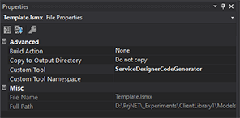
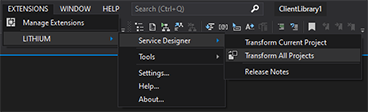
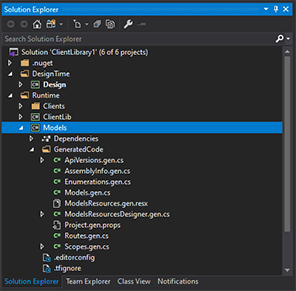

# Lithium Code Generator

The great benefit of using the Lithium Modeling Framework and the Service Designer to model microservices it that it can automatically generate a significant part of the code required to implement the service.

This code generation framework is based on the Microsoft Modeling SDK and T4 features and is implemented by a code generator named "ServiceDesignerCodeGenerator".

## Text Templates

Each project in a microservice solution includes a file named "Template.lsmx" that has the code generator configured as the custom tool.



This file is very simple and it basically specifies which project the file is in (to allow the framework to generate the correct artifacts for that project):

```xml
<?xml version="1.0" encoding="utf-8"?>
<template>
    <kind>Models</kind>
    <model>..\Design\Service.lsm</model>
</template>
```

> Do not modify these files.

## Transformation

Transformation - the process of generating the code artifacts from text templates - will always be initiated by the developer using one of the two options available in the Lithium menu:



You can transform a single project (the one selected in Solution Explorer) or all the projects in the solution.

When a project is transformed, all the generated code will be placed in the `GeneratedCode` folder:



> Do not edit these files as they will be replaced every time the project is transformed.