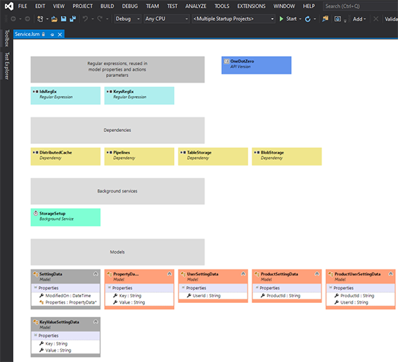
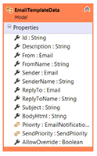
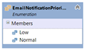
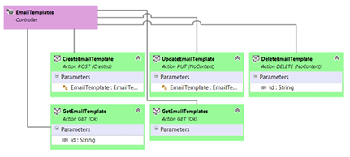
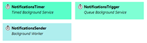
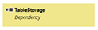
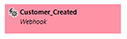
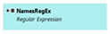

# Lithium Service Designer

The Service Designer is a domain-specific language, integrated in Visual Studio 2019, that allows modeling a microservice.

This language defines a set of concepts - domain entities - that, together, will define the shape of microservice Web API and its behavior.

The resulting model will then be used by the Lithium Modeling Framework to generate the code for the microservice.

## Design project

All the Lithium Visual Studio solutions include a project named `Design` that contains a file named `Service.lsm`.

This file describes the service model (as XML). When opened, the service designer will show up and setup a design surface where the microservice model can be constructed.

## Concepts (domain entities)

The Lithium Service Model includes a set of concepts to describe the microservice. Each as its own purpose and may or not be required for a particular microservice, depending on the features one wants to include.

The metamodel used by this designer adheres, in most cases, to how a REST Web API is usually described - as set of endpoints that manage resources - and, in particular, to how this kind of API concepts map to ASP.NET Core concepts.

- Resources - the pieces of data being transferred - are called "models".
- Endpoints are implemented by controller actions.
- Controllers aggregate actions logically.
- A service defines the Web API as a whole, aggregating controllers.

The following domain entities are available (ordered alphabetically):

- [API version](#apiversion)
- [Authorization Policy](#authorizationpolicy)
- [Background Service](#backgroundservice)
- [Background Worker](#backgroundworker)
- [Controller](#controller)
- [Controller Action](#controlleraction)
- [Enumeration](#enumeration)
- [Dependency](#dependency)
- [Model](#model)
- [Regular Expression](#regularexpression)
- [Service](#service)
- [Service Dependency](#servicedependency)
- [Webhook](#webhook)

### Service

This is most important domain entity and it is represented in the service designer by the design surface (the canvas). It describes the microservice and allows specifying its main characteristics.

The following properties are the most important for the service:

| Property | Description | Example |
| - | - | - |
| `Authorization Mode `| A value indicating whether the service uses authorization (with Identity Server) or not | On |
| `Id` | A unique identifier for the service | SS |
| `Default Scope` | The name of the default scope used for authorization | lithium-settings |
| `Display Name` | The display name of the service  | Settings Service |
| `Name` | The name of the service | Settings |
| `Namespace` | The namespace associated with the service | Primavera.Lithium.Settings |
| `Version` | The service version | 1.0 |

Other configuration properties can only be modified by opening a configuration editor that is launched by clicking the ellipsis available in the `Configuration` property:

| Property | Description | Example |
| - | - | - |
| `Generate Client Library` | A value indicating whether the client library for the service should be generated | True |
| `Generate Support for OIDC` | A value indicating whether the microservice should support OIDC (OpenID Connect), to allow for features that require user authentication | False |
| `Generate Web API` | A value indicating whether the microservice generates (includes) a Web API (false only if the solution is for a client library only) | True |
| `Use Client Credentials Client` | A value indicating whether a client for the client credentials authorization flow is to be used | True |
| `Use Hybrid Client` | A value indicating whether a client for the hybrid authorization flow is to be used  | False |

### Model

A model describes one resource managed by the microservice Web API. 

You can have as many as needed in the model and they represent the pieces of data accepted and/or returned by the Web API endpoints.

> The Web API resources are called "models" in Lithium because the term resources is used in .NET for other concepts and that duplication would result in conflicts and misconceptions.

In the end a model is translated into a POCO (plain old C# object). A simple C# class (with properties) that describes the data object.

The most important properties of a model are:

| Property | Description | Example |
| - | - | - |
| `Base Model` | Another model that acts as the base for this one (in terms of inheritance) | SettingData |
| `Inheritance Modifier` | A modifier that allows making a model abstract (for inheritance) | None |
| `Name` | The name of the model | ProductSettingData |
| `Visibility` | Allows indicating whether the model is only visible in the Web API | All |

As you would expect, a model can have one or more properties and these can be of 3 kinds:

- **Scalar** - the property value is scalar, meaning that is of a framework type (string, integer, Guid, etc.)
- **Enumeration** - the property value is a member of an enumeration defined in the service model.
- **Model** - the property value is another model defined in the service model.

The following properties, among others, are available for **Scalar** properties:

| Property | Description | Example |
| - | - | - |
| `Cardinality` | Indicates whether the property value is single, a list, or a dictionary | Single |
| `Default Value` | The property default value | 0 |
| `Display Name` | The property display name | Identifier |
| `Is Nullable` | Indicates whether the property is nullable (for value types) | False |
| `Kind` | The kind of property (normal or calculated) | Normal |
| `Name` | The property name | Id |
| `Type` | The property type | Guid |

The following properties are available for **Enumeration** properties:

| Property | Description | Example |
| - | - | - |
| `Cardinality` | Indicates whether the property value is single, a list, or a dictionary | Single |
| `Default Value` | The property default value | ValueKind.Value |
| `Display Name` | The property display name | Identifier |
| `Name` | The property name | Id |
| `Kind` | The kind of property (normal or calculated) | Normal |
| `Referenced Enumeration` | The enumeration that is referenced by the property | ValueKind |

The following properties are available for **Model** properties:

| Property | Description | Example |
| - | - | - |
| `Cardinality` | Indicates whether the property value is single, a list, or a dictionary | Single |
| `Display Name` | The property display name | Identifier |
| `Name` | The property name | Id |
| `Kind` | The kind of property (normal or calculated) | Normal |
| `Referenced Model` | The model that is referenced by the property | ValueData |

> You can model simple 1:N relations, for example, by having model A have a model property that references model B and setting that property to a be list.

### Enumeration

As the name implies, an enumeration is a special kind of model that is translated to an enumeration instead of a class, resulting in that its value can only be one of a set of predetermined values.

 Property | Description | Example |
| - | - | - |
| `Name` | The name of the enumeration | ValueKind |

You can specify one or more members for the enumeration (the possible values). Each member as a name and a unique value (an integer).

### Controller

Controllers group related actions (the API endpoints).

Typically, you should group all the operations that act on the same model in a single controller.

You should consider that controllers also define 3 very important aspects of the Web API behavior:

- They set the base route of the endpoints (see the "Route" property).
- They define the authorization mode (and the corresponding policy) shared by all its actions.
- They may define parameters (for the route) shared between all the controller's actions.

The most important properties of a controller are:

| Property | Description | Example |
| - | - | - |
| `Authorization Mode` | A value indicating whether the controller actions use authorization (with Identity Server) or not | On |
| `Authorization Policy` | The name of the policy used for authorization by the controller actions | (default) |
| `Name` | The name of the controller | UserSettings |
| `Route` | The base route for all the child actions | /api/v{version:apiVersion}/usersettings |
| `Visibility` | Allows indicating whether the controller is only visible in the Web API | All |

> Notice that it is possible to share the same authorization policy among the controller actions but it is also possible to specify different policies for different actions of the same controller.

### Controller Action

An action describes a Web API endpoint, an operation provided by the microservice. They can accept parameters (or not), and return a result (or not).

These operations are modeled considering the rules of HTTP and REST.

The most important properties of a controller action are:

| Property | Description | Example |
| - | - | - |
| `Authorization Mode` | A value indicating whether the action uses authorization (with Identity Server) or not | On |
| `Authorization Policy` | The name of the policy used for authorization by action | (controller) |
| `HTTP Method` | The HTTP method used | Get |
| `Name` | The name of the operation | GetUserSetting |
| `Return Value Cardinality` | Indicates whether the return value is single, a list, or a dictionary | Single |
| `Return Value Type` | The type of the return value (can be scalar or a model) | Model |
| `Route` | The complete route of the endpoint | GET /api/v{version:apiVersion}/usersettings/{userId}/{key} |
| `Success Status Code` | The HTTP status code that is returned when the operation succeeds | Ok |
| `Visibility` | Allows indicating whether the controller action is only visible in the Web API | All |

> Note that an action may return a result or not depending on the HTTP method in use (for example, a GET always returns a value).

#### Controller Action Parameters

You can define zero or more parameters for the controller action and these can be of 3 kinds (similar to model properties):

- **Scalar** - the parameter value is scalar, meaning that is of a framework type (string, integer, Guid, etc.)
- **Enumeration** - the parameter value is an enumeration defined in the model.
- **Model** - the parameter value references a model defined in the model.

#### Controller Parameters

Parameters can also be defined in the controller and will be shared between all the actions of that controller (unless property `Ignore Controller Parameters` is set to false).

This kind of parameters can only be of two kinds, Scalar or Enumeration, and always affect the endpoint route (controller parameters use `FromRoute` binding).

### Background Service

The Lithium Framework allows you to add background services to the microservice solution. These services will be automatically executed when the service application starts and run work (custom logic) in the background.

Background services come in three flavors:

- Normal background services - a basic background service that just starts when the service application starts.
- Timed background services - a background service that executes every time a given timespan ellapses.
- Queue background services - a background service that executes every time an new item becomes available in a queue.

The most important properties of a background service are:

| Property | Description | Example |
| - | - | - |
| `Name` | The name of the background service | StorageSetup |
| `Use Worker` | A value indicating whether a worker is associated with the background service | False |

> When "Use Worker" is true, you will need to model a background worker and set it in the "Worker" property of the associated background service.

### Background Worker

Workers allow sharing behavior between different background services. You define a single worker - and later implement it's logic - and reference it in multiple background services.

### Dependency

Dependencies allow for two things:

- Describing the dependencies of the microservice on external services (la REDIS cache, for example).
- Adding features to the microservice.

> These dependencies will affect the code generated for the microservices and, in most cases, will just work out the box (without requiring the developer to add any custom code).

A dependency as only one important property:

| Property | Description | Example |
| - | - | - |
| `Kind` | The kind of dependency that should be added | BlobStorage |

### Service Dependency

Service dependencies allow describing the dependencies of other Lithium microservices.

> These dependencies will affect the code generated for the microservices and, in most cases, will just work out the box (without requiring the developer to add any custom code).

A service dependency as only one important property:

| Property | Description | Example |
| - | - | - |
| `Service` | The name of the service | Certificates |

### Webhook

Webhooks are added to the model to describe the webhook events published by the service, which it is required to configure the corresponding services.

> When a webhook is added to the service, a set of controller actions will be automatically generated for the Web API. These actions allow client applications to subscribe the webhooks. The service will be responsible for publishing the events in custom code using the services available in Hydrogen.

The most important properties of a webhook are:

| Property | Description | Example |
| - | - | - |
| `Name` | The name of the webhook | Customer_Created |
| `Event Description` | The description of the event that causes the webhook to be invoked | --- |
| `Payload Description` | The description of the payload (the data) that is sent to the webhook callback | --- |

### Regular Expression

As you will see, both models and controller action parameters allow specifying validation rules that will be enforced automatically by the framework. One kind of these validation rules allows checking values against a regular expression.

The regular expression domain entity provides the means to specify these regular expressions only once in the service model and then reusing them in multiple validation rules.

The most important properties of a regular expression are:

| Property | Description | Example |
| - | - | - |
| `Name` | The name of the regular expression | IdsRegEx |
| `Value` | The actual regular expression |  |

### Authorization Policy

Authorization policies is a concept in the service model that allows specifying which scope is validated when accessing controller actions (if `Kind` is `Scope`) or custom authorization policies (entirely specified in custom code).

### API Version

Each microservice as a version defined in the service properties. This version, among other things, sets the API version (used in the endpoint routes) that is validated by a API versioning middleware that is automatically setup by the framework.

A service can support more than one version only to some extent. Currently you can only specify that all the actions defined in the service respond to the default version (the one specified in the service properties) and to all the API versions described in the service model.

> A future version of the Lithium Framework will allow to specify different API versions for different controller actions.

An API version has a single relevant property:

| Property | Description | Example |
| - | - | - |
| `Version` | The version number (in the form Major.Minor) | 2.0 |

### Comment

A comment is an artifact that has the only purpose of commenting the service model. It has no effect what so ever in the service behavior.