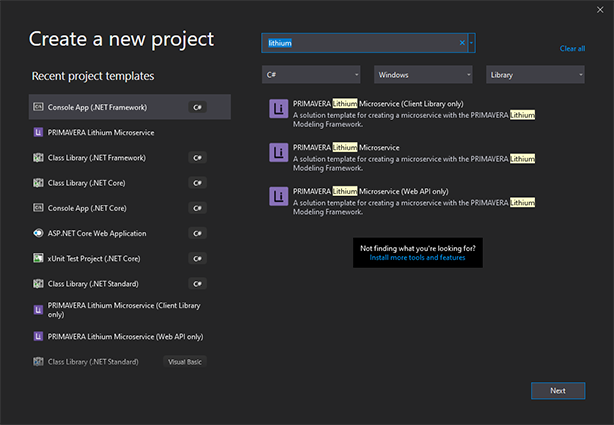
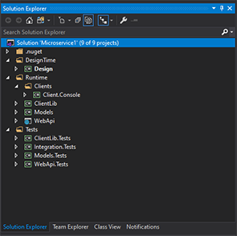
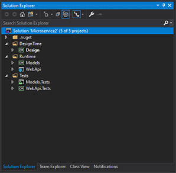
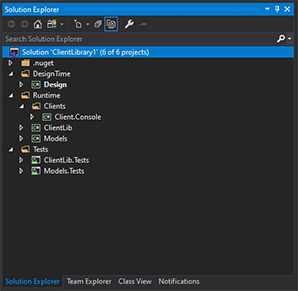

# Lithium Solution Templates

The Lithium SDK installs in Visual Studio a set of solution templates that allow creating microservices using the Lithium Modeling Framework.

These solution templates ensure the architecture of the microservice and provide access to all the features of the framework, including the service designer and the code generator.

Currently there are 3 solution templates available:

## Lithium Microservice

This template creates the solution for a full microservice, according to the Lithium architecture.

The resulting solution contains all the projects required to build the microservice Web API and the respective client library.

## Lithium Microservice (Web API only)

Some microservices may not require the development of the client library. This template creates the solution for this kind of service.

> This is the case, for example, for microservices that are designed to work mostly with the Hybrid grant type (containing User Interface).

The resulting solution contains only the projects required to develop the Web API.

## Lithium Microservice (Client Library only)

Although Lithium was conceived to develop microservices (with a Web API), the Lithium Modeling Framework can also be leveraged to create client libraries for other existing REST services.

This template creates the solution required to develop such client libraries.

## Upgrades

As new versions of the Lithium SDK become available, new versions of these templates will also be distributed.

The Lithium SDK will automatically validate the solution version (when the solution is opened in Visual Studio)  and warn when upgrades are required, providing the necessary actions to update the solution.