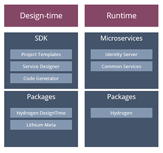

# Lithium Architecture

The Lithium Framework provides a set of components to assist and accelerate the development of microservices according to a base architecture.

It also provides runtime components - like Hydrogen - that provide standard and cross-cutting features that can be reused in any microservice.

Some of the microservices developed with Lithium are also part of the framework, in the sense that they provide common features that can be referenced and reused by other microservices.

## Next

[Microservice Architecture](4-microservice-architecture.md)
