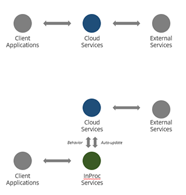
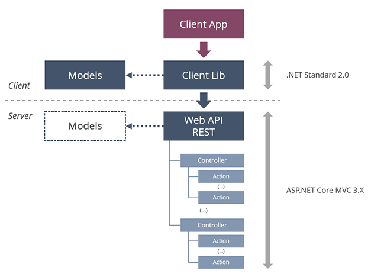

# Microservice Architecture

The Lithium Framework defines a very simple - yet standard - architecture that all microservices must adhere to to be correctly generated, developed, and managed.

This architecture defines the pieces that compose the microservice.

## Kinds of Microservices

From an architectural point-of-view, as much as the behavior expected by consumers, the Lithium microservices can be divided in two kinds:

- **Cloud Services**: these microservices execute in the cloud and provide a REST Web API for consumers; they implement a given set of related features or they can act simply as proxies for other (third-party) services.
- **InProc Services**: these microservices are provided to consumers as binary client libraries that execute the whole or the part of the microservice business logic in the same process as the consumer, typically because of performance restrictions or because Internet access is not always guaranteed; that business logic can be implemented by invoking cloud services or not.

## Anatomy of a Microservice

This is the basic architecture diagram for a Lithium microservice:

### Client App

"Client App" represents the application that consumes the microservice using the client library, or, in some special cases, the Web API directly.

### Client Lib

The client library provides an assembly that represents the Web API and allows calling it correctly and simplifies the usage of most cross-cutting features like authorization, versioning, localization, etc. These client libraries are currently generated in C# but they could be produced in any programming language.

This library is .NET Standard 2.0 so it can be referenced from any .NET or .NET Core consumer.

### Models

There is an assembly, called Models, that is shared between the client library and the Web API, that defines the data structures (the models) used in the Web API actions' parameters and results.

This library is also .NET Standard 2.0.

### Web API REST

The microservice Web API is a ASP.NET Core Web API, RESTful.

### Controllers and Actions

Being a ASP.NET Core Web API, all the microservices operations are provided in controllers and by actions inside those controllers.

### Modeling and Code Generation

The Lithium Modeling Framework allows modeling the microservice endpoints and behavior using a specific model. This allows the automatic generation of most of the code required to implement the microservice:

- The ClientLib and Models code is 100% automatically generated (but it can be customized).
- In the case of the Web API, the code generators will produce the skeleton for all operations and leave up to the developers to implement the actual business logic. This skeleton includes all the code required to configure ASP.NET Core and the respective infrastructure, so the developer basically needs to focus in the business-logic only.

## Next

> [Designing Microservices](./5-designing-microservices.md)
