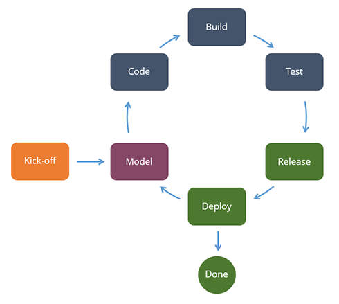

# Designing Microservices

The design of a microservice starts from the moment when the opportunity to develop it is identified and when the general functional requirements are gathered.

It is very important that this initial concept is completely aligned with the objectives and motivations behind Lithium, as it is important that the design of the microservice adheres to the architecture described before and aligned with the infrastructure available to run it.

## Initial Setup

Once the development team defines the initial requirements, it should start the development project by organizing a meeting (the **kick-off meeting**) with the **Lithium team**, the **SWE** and the **CMS** teams to discuss the objectives and the design.

The Lithium team will provide:

- Guidance on best practices, known malpractices, and training on using the Lithium SDK.
- Support in the design and the development of the service (when needed).
- Improvements on the Lithium Framework required to support the intended features.

The SWE team will provide:

- Builds and releases for the project.
- Improvements on the CI/CD practices to accommodate the project needs.

The CMS team will provide:

- Guidance on the platform services available in the cloud infrastructure recommended for the service features.
- Improvements on the infrastructure (when needed).

After this initial setup phase, the development team is supposed to have in place a good concept and initial design of the microservice. From then on, the development project should follow the same methodology as any other project, considering that development is model-driven.

## Model-driven Development

It starts in the service designer, followed by code generation, then developers add the specific custom logic, interactively until the service is ready for deployment in the production environment.

Using the Lithium SDK is crucial, because it provides the designer and accelerates development through code generation. Furthermore, using the SDK also ensures that any service can be easily upgraded and adapted as the Lithium Framework evolves, either in the design-time components as in the runtime components.

## Next

> [Deploying Microservices](6-deploying-microservices.md)
